# 🎧 AudioGo — Product Requirements Document (PRD)

> **Hệ Thống Thuyết Minh Du Lịch Đa Ngôn Ngữ**  
> *Dự án kỹ thuật số hóa Phố Ẩm Thực Vĩnh Khánh, Quận 4, TP.HCM*  
> *Cập nhật: 12/05/2026*

---

## Mục lục

1. [Giới Thiệu Chung](#-1-giới-thiệu-chung-executive-summary)
2. [Phân Quyền & Đối Tượng Người Dùng](#-2-phân-quyền--đối-tượng-người-dùng-user-roles)
3. [User Stories & Yêu Cầu Chức Năng](#-3-user-stories--yêu-cầu-chức-năng-functional-requirements)
4. [Yêu Cầu Phi Chức Năng](#%EF%B8%8F-4-yêu-cầu-phi-chức-năng-non-functional-requirements)
5. [Technology Stack & Kiến Trúc Hệ Thống](#%EF%B8%8F-5-technology-stack--kiến-trúc-hệ-thống)
6. [Cơ Sở Dữ Liệu](#%EF%B8%8F-6-cơ-sở-dữ-liệu-database-schema)
7. [Danh Mục API Routes](#-7-danh-mục-api-routes-net-core)
8. [Web CMS — Cấu Trúc Trang](#%EF%B8%8F-8-web-cms--cấu-trúc-trang-react-routes)
9. [Sơ Đồ Usecase](#-9-sơ-đồ-usecase-use-case-diagrams)
10. [Sơ Đồ Trình Tự (Sequence Diagrams)](#-10-sơ-đồ-trình-tự-sequence-diagrams)
11. [Sơ Đồ Hoạt Động (Activity Diagrams)](#-11-sơ-đồ-hoạt-động-activity-diagrams)

---

## 📅 1. GIỚI THIỆU CHUNG (EXECUTIVE SUMMARY)

**AudioGo** là nền tảng số hóa trải nghiệm du lịch thông qua âm thanh (Audio-Guided Route). Dự án áp dụng mô hình Client-Server để cung cấp chức năng phát âm thanh tự động dựa trên vị trí địa lý (Geofencing) trên Mobile App dành cho du khách, kết hợp với Web CMS quản trị đa ngôn ngữ và phân tích dữ liệu chuyên sâu dành cho Ban quản lý (Admin) và Chủ cửa hàng (POI Owner).

**Hệ thống bao gồm 3 thành phần chính:**

| Thành phần | Công nghệ | Trạng thái |
| :--- | :--- | :--- |
| **Backend API** | ASP.NET Core 10, EF Core 9, SQL Server | ✅ Hoàn thiện |
| **Mobile App** | .NET MAUI (Android) | ✅ Hoàn thiện |
| **Web CMS** | React 19, Vite 6, TailwindCSS | ✅ Hoàn thiện |

Mục tiêu tài liệu này (PRD) là đóng vai trò chuẩn hóa mọi yêu cầu nghiệp vụ (Business Requirements), yêu cầu chức năng (Functional Requirements), API routes, sơ đồ UML, và tiêu chí nghiệm thu (Acceptance Criteria).

---

## 👥 2. PHÂN QUYỀN & ĐỐI TƯỢNG NGƯỜI DÙNG (USER ROLES)

| Vai trò (Actor) | Nền tảng | Quyền hạn (Permissions) | Xác thực |
| :--- | :--- | :--- | :--- |
| **Du khách (Guest)** | Mobile App | Xem bản đồ, quét QR kích hoạt, tự động nghe Audio khi đi vào hàng rào ảo, tìm kiếm/lọc POI, xem Tour. | Quét mã QR → JWT `GuestApp` (7 ngày) |
| **Chủ quán (POI Owner)** | Web CMS | Xem/Thêm/Sửa POI của mình, upload media. | JWT Bearer (`Owner`) |
| **Admin Hệ thống** | Web CMS | Toàn quyền: CRUD POI, Account, Category, Tour. Chạy Content Pipeline. Xem Dashboard Analytics. | JWT Bearer (`Admin`) |

---

## 📚 3. USER STORIES & YÊU CẦU CHỨC NĂNG (FUNCTIONAL REQUIREMENTS)

### Epic 1: Trải Nghiệm Khám Phá Của Du Khách (Mobile App — .NET MAUI)

**US 1.1 — Xác Thực QR Code (App Access)**
> *Là một Du khách, tôi muốn quét mã QR được cấp để kích hoạt quyền truy cập ứng dụng trong 7 ngày.*
- **FR:**
  - Mobile gửi `POST /api/mobile/auth/scan-qr` với `{ code, deviceId }`.
  - Backend kiểm tra `AppAccessCodes`: mã chưa dùng → kích hoạt, gán `DeviceId`, đặt `ExpireAt = +7 ngày`.
  - Mã đã dùng bởi thiết bị khác → `403 Forbid`. Mã hết hạn → `403 Forbid`.
  - Trả về JWT token role `GuestApp`.
- **AC:**
  - [x] Quét QR lần đầu: Kích hoạt thành công, ứng dụng hoạt động bình thường.
  - [x] Quét QR bằng thiết bị khác: Bị từ chối.
  - [x] Quét QR sau 7 ngày: Bị từ chối, cần mã mới.

**US 1.2 — Nhận Diện Hàng Rào Ảo (Geofencing Audio)**
> *Là một Du khách, tôi muốn ứng dụng tự động phát đoạn thuyết minh khi tôi đi bộ gần tới một POI.*
- **FR:**
  - Sử dụng công thức **Haversine** để tính khoảng cách định kỳ.
  - Kích hoạt Audio khi `Current Distance <= POI.ActivationRadius`.
  - Chỉ phát POI có `IsActive = true`.
- **AC:**
  - [x] App nhận diện thành công trong vòng tối đa 2-3 giây.
  - [x] Audio tự động phát mượt mà (nếu đã preload xuống SQLite).
  - [x] Ưu tiên POI có `Priority` cao nhất nếu chồng hàng rào.

**US 1.3 — Cơ Chế Chống Spam (Anti-spam / Cooldown)**
> *Là một Du khách, tôi không muốn điện thoại lặp lại cùng một audio khi đứng sát ranh giới.*
- **FR:** Cooldown **5 phút** cho mỗi POI ID tính từ thời điểm audio bắt đầu phát.
- **AC:**
  - [x] Ra vào lại trong 5 phút → Không phát lại. Vào sau phút thứ 6 → Phát lại bình thường.

**US 1.4 — Tìm Kiếm & Lọc POI**
> *Là Du khách, tôi muốn tìm kiếm quán ăn theo tên hoặc lọc theo danh mục.*
- **FR:**
  - `GET /api/mobile/pois?lang=vi&q=hải+sản&category=Hải Sản`
  - `GET /api/mobile/categories`
- **AC:**
  - [x] Kết quả trả về đúng ngôn ngữ (`lang` param). Filter category hoạt động chính xác.

**US 1.5 — Mini-Player & Xem Chi Tiết POI**
> *Là Du khách, tôi muốn nghe audio qua mini-player và xem chi tiết quán (gallery ảnh, mô tả).*
- **FR:**
  - `GET /api/mobile/pois/{poiId}?lang=vi` — chi tiết kèm content theo ngôn ngữ.
  - Mini-Player với Play/Pause/Seek, gallery ảnh carousel.
- **AC:**
  - [x] Audio phát mượt mà, thanh progress hiển thị. Gallery ảnh vuốt ngang.

**US 1.6 — Xem Tour (Lộ Trình Tham Quan)**
> *Là Du khách, tôi muốn xem các Tour và đi theo lộ trình gợi ý.*
- **FR:**
  - `GET /api/mobile/tours?lang=vi` — danh sách tour (có filter `?q=` tìm kiếm).
  - `GET /api/mobile/tours/{tourId}?lang=vi` — chi tiết tour: steps kèm POI info + audio.
  - `GET /api/mobile/tours/directions?waypoints=&mode=` — đường đi ORS.
- **AC:**
  - [x] Hiển thị lộ trình theo `StepOrder`. Nội dung đúng ngôn ngữ. `SyncService` cache offline.

**US 1.7 — Đồng Bộ Offline-First**
> *Là Du khách, tôi muốn ứng dụng vẫn hoạt động khi mất kết nối internet.*
- **FR:**
  - `SyncService` đồng bộ toàn bộ POI (`IsActive = true`) xuống SQLite.
  - Geofencing + Audio playback hoạt động offline sau sync đầu.
- **AC:**
  - [x] App offline sau lần mở đầu. Có mạng → tự sync dữ liệu mới.

**US 1.8 — Ghi Nhận Hành Vi (Analytics Passive)**
> *Mobile âm thầm ghi nhận lịch sử nghe và vị trí GPS.*
- **FR:**
  - `POST /api/mobile/listen-history` — ghi nhận lịch sử nghe (`DeviceId`, `PoiId`, `ListenDuration`).
  - `POST /api/mobile/location-log` — batch GPS log (offline buffer flush).
- **AC:**
  - [x] Buffer local khi offline, flush khi có mạng. Admin xem được qua Dashboard.

---

### Epic 2: Quản Lý Nội Dung (Web CMS — POI Owner)

**US 2.1 — Đăng Nhập CMS**
> *Là Chủ Quán, tôi muốn đăng nhập CMS để quản lý POI.*
- **FR:**
  - `POST /api/auth/login` → JWT token. Redirect theo role → `/pois`.
- **AC:**
  - [x] Đăng nhập thành công hiện sidebar tương ứng role. Sai → thông báo lỗi.

**US 2.2 — Xem & Thêm POI**
> *Là POI Owner, tôi muốn xem danh sách và tạo mới POI.*
- **FR:**
  - `GET /api/cms/pois` — danh sách POI.
  - `POST /api/cms/pois` — tạo POI mới.
  - Upload logo qua `POST /api/cms/upload/image` trước.
- **AC:**
  - [x] Tạo POI thành công, hiện trong danh sách. Logo upload lên Azure Blob.

**US 2.3 — Quản Lý Nội Dung Đa Ngôn Ngữ**
> *Là POI Owner, tôi muốn nhập nội dung thuyết minh và quản lý bản dịch.*
- **FR:**
  - `GET/POST/PUT/DELETE /api/cms/pois/{poiId}/content` — CRUD content.
  - Khi sửa bản Master (`IsMaster = true`), tự động xóa tất cả Slave (buộc re-generate).
- **AC:**
  - [x] Master thay đổi → Slave bị xóa. Chạy lại Pipeline để gen mới.

**US 2.4 — Upload Media**
> *Là POI Owner, tôi muốn upload audio hoặc ảnh gallery.*
- **FR:**
  - `POST /api/cms/upload/audio` — max **50MB** (mp3/wav/ogg/m4a/aac).
  - `POST /api/cms/upload/image` — max **10MB** (jpg/png/webp/gif).
  - `POST/DELETE /api/cms/pois/{poiId}/gallery` — quản lý gallery.
- **AC:**
  - [x] File lên Azure Blob, trả URL. Sai định dạng → 400.

**US 2.5 — Gửi Yêu Cầu Thay Đổi POI (PoiRequest Workflow)**
> *Là POI Owner, tôi muốn gửi yêu cầu tạo/sửa/xóa POI và chờ Admin duyệt để không ảnh hưởng dữ liệu live.*
- **FR:**
  - Owner gửi `POST /api/cms/pois/requests` với `{ actionType: CREATE|UPDATE|DELETE, draft: PoiDraftDto }`.
  - Request lưu vào bảng `PoiRequest` với `Status = PENDING`, không thay đổi dữ liệu `Poi` live ngay.
  - Owner xem trạng thái tại `GET /api/cms/pois/requests/my-requests`.
  - **Priority tự động gán theo gói:** Khi Admin duyệt `CREATE`, `Poi.Priority` được set = `SubscriptionPlan.AutoPriority` của Owner — **bất kể giá trị draft gửi lên**. Với `UPDATE`, Priority bị cap tối đa = `AutoPriority` gói hiện tại (không thể tự nâng).
  - Owner không được tự chỉ định Priority vượt mức gói đang dùng.
- **AC:**
  - [x] Tạo request → PENDING. Admin duyệt → APPROVED → dữ liệu live cập nhật. Admin từ chối → REJECTED + rejectReason.
  - [x] POI mới tạo luôn có Priority = AutoPriority của gói Owner, không phụ thuộc FE.

**US 2.6 — Nâng Gói Subscription**
> *Là POI Owner, tôi muốn nâng gói dịch vụ để có thêm POI và tính năng.*
- **FR:**
  - Owner xem các gói tại `GET /api/cms/subscriptions/plans`.
  - Owner khởi tạo thanh toán `POST /api/cms/subscriptions/upgrade/init { planId, gateway: SEPAY|MOMO }` → nhận VietQR.
  - Webhook SePay/MoMo tự động kích hoạt subscription sau khi thanh toán thành công.
- **AC:**
  - [x] Thanh toán thành công → `OwnerSubscription` ACTIVE, `Account.SubscriptionPlanId` cập nhật.
  - [x] Nếu downgrade → POI vượt quota bị hạ priority tự động.

---

### Epic 3: Hệ Thống Quản Trị Toàn Diện (Web CMS — Admin)

**US 3.1 — Dashboard Tổng Quan**
> *Là Admin, tôi muốn xem thống kê tổng quan.*
- **FR:**
  - `GET /api/cms/analytics/top-pois?top=10` — Top N POI nghe nhiều nhất.
  - `GET /api/cms/analytics/heatmap` — Heatmap vị trí (~100m grid).
- **AC:**
  - [x] Dashboard hiển thị dữ liệu chính xác. Top POI kèm tên (join PoiContent).

**US 3.2 — Quản Lý Tài Khoản (CRUD)**
> *Là Admin, tôi muốn tạo/sửa/khóa/xóa tài khoản Owner.*
- **FR:**
  - `GET/POST/PUT/DELETE /api/cms/accounts` — CRUD account. Password hash **BCrypt**.
- **AC:**
  - [x] Trùng username → 400. Khóa → Owner không đăng nhập được.

**US 3.3 — Quản Lý Danh Mục (Category)**
> *Là Admin, tôi muốn CRUD danh mục và gán/bỏ gán POI.*
- **FR:**
  - `GET/POST/PUT/DELETE /api/cms/categories` — CRUD danh mục.
  - `POST/DELETE /api/cms/categories/{id}/pois` — gán/bỏ POI.
- **AC:**
  - [x] Hiển thị `PoiCount`. Mobile lấy qua `GET /api/mobile/categories`.

**US 3.4 — Quản Lý Tour (Lộ Trình Tham Quan)**
> *Là Admin, tôi muốn thiết kế Tour tham quan cho du khách.*
- **FR:**
  - `GET/POST/PUT/DELETE /api/cms/tours` — CRUD tour. Tạo mới tự dịch 7 ngôn ngữ qua `ITranslationService`.
  - `PATCH /api/cms/tours/{id}/restore` — khôi phục tour bị soft-delete.
  - `POST/DELETE /api/cms/tours/{id}/pois` — thêm/xóa POI.
  - `PUT /api/cms/tours/{id}/pois/{poiId}/order` — đổi thứ tự bước.
- **AC:**
  - [x] Tour hiển thị đúng thứ tự `StepOrder`. Mobile lấy chi tiết kèm audio qua `TourMobileController`.

**US 3.5 — Content Pipeline: Dịch Thuật & Âm Thanh Tự Động**
> *Là Admin, tôi muốn hệ thống tự động dịch và tạo audio cho 7 ngôn ngữ.*
- **FR — 3 cấp độ Pipeline:**

| Endpoint | Mô tả | Scope |
| :--- | :--- | :--- |
| `POST /api/cms/pipeline/generate/{poiId}` | Generate audio cho 1 POI — tất cả ngôn ngữ đang có content. | Đơn lẻ |
| `POST /api/cms/pipeline/generate-all` | Generate audio cho tất cả content thiếu AudioUrl (POI `IsActive`). | Batch Audio |
| `POST /api/cms/pipeline/generate-all-languages` | **Full Pipeline**: Dịch + TTS cho **7 ngôn ngữ** × tất cả Active POI. | Bulk Full |
| `GET /api/cms/pipeline/status` | Kiểm tra trạng thái content/audio. | Monitoring |

- **Quy trình Bulk Pipeline (`generate-all-languages`):**
  1. Lấy tất cả POI có `IsActive = true` kèm Contents.
  2. Mỗi POI × mỗi ngôn ngữ (`vi, en, ja, ko, zh-Hans, fr, th`):
     - `EnsureContentAsync()`: Chưa có → dịch từ Master (Azure Translator) → tạo record.
     - Thiếu `AudioUrl` → `GenerateAudioAsync()`: TTS → MP3 → Upload Blob → cập nhật.
- **AC:**
  - [x] 7 ngôn ngữ × N POI đều có content + audio.
  - [x] Response: `{ successCount, failCount, results[] }`.

**US 3.6 — Duyệt Yêu Cầu POI Của Owner**
> *Là Admin, tôi muốn xem và phê duyệt/từ chối các request thay đổi POI của Owner.*
- **FR:**
  - `GET /api/cms/pois/requests?status=PENDING` — danh sách tất cả request.
  - `GET /api/cms/pois/requests/stats` — thống kê PENDING theo loại.
  - `PUT /api/cms/pois/requests/{requestId}/review { status: APPROVED|REJECTED, rejectReason? }` — phê duyệt.
  - Khi APPROVED: `IPoiRequestService.ReviewPoiRequestAsync()` apply `proposedData` JSON vào bảng `Poi`.
- **AC:**
  - [x] Admin duyệt CREATE → POI mới xuất hiện trên Mobile. Duyệt UPDATE → POI cập nhật. Duyệt DELETE → POI bị xóa.
  - [x] Từ chối → Owner thấy REJECTED + lý do.

**US 3.7 — Quản Lý Subscription & Giao Dịch**
> *Là Admin, tôi muốn xem và quản lý gói dịch vụ của tất cả Owner và lịch sử giao dịch.*
- **FR:**
  - `GET /api/cms/subscriptions/owner/{accountId}` — xem subscription history.
  - `POST /api/cms/subscriptions/owner/{accountId}/assign { planId, gateway: MANUAL }` — gán gói thủ công (0đ).
  - `GET /api/cms/payments` — lịch sử giao dịch (filter type, status, date).
- **AC:**
  - [x] Admin assign gói thủ công → subscription ACTIVE ngay, transaction ghi MANUAL.
  - [x] Dashboard lịch sử giao dịch hiển thị đúng status (PENDING/SUCCESS/FAILED).

**US 3.8 — Geofence Conflict Simulator (Debug Tool)**
> *Là Admin, tôi muốn giả lập cơ chế tranh chấp Geofence để kiểm chứng logic 3-Tier trước khi demo hoặc debug.*
- **FR:**
  - `POST /api/cms/debug/geofence-simulate` — nhận tọa độ thiết bị + danh sách POI tùy chỉnh (`CustomPois[]`).
  - Khi `CustomPois` được gửi lên: dùng POI fake (không query DB, không persist). Khi không có: dùng POI active từ DB.
  - Trả về: `Winner` (PoiId, Name, DecisionTier, Reason) + `CandidatePois[]` (rank, distance, tier scores) + `SortingTrace[]` (log từng bước giải quyết conflict).
  - `DecisionTier` có 4 giá trị: `Trivial_OnlyOne`, `Tier1_Priority`, `Tier2_HasLocalAudio`, `Tier3_Distance`.
  - Logic sort 3-Tier hoàn toàn giống `GeofenceService.cs` trên Mobile (parity đảm bảo).
- **AC:**
  - [x] Simulator chứng minh đúng 3-Tier: Priority → HasLocalAudio → Distance.
  - [x] Log hiển thị rõ tier nào quyết định, ai thắng, ai thua và lý do.
  - [x] Chạy không ảnh hưởng dữ liệu production (read-only hoặc in-memory).
  - [x] Chỉ Admin mới truy cập được (`[Authorize(Roles = "Admin")]`).

---

## ⚙️ 4. YÊU CẦU PHI CHỨC NĂNG (NON-FUNCTIONAL REQUIREMENTS)

| Tiêu chí | Mô tả Yêu cầu (NFR) |
| :--- | :--- |
| **Bảo mật (Security)** | Web CMS: **JWT Bearer** (BCrypt hash). Mobile: QR → JWT `GuestApp`. CORS tách riêng `WebCmsPolicy` / `MobilePolicy`. |
| **Sẵn sàng (Availability)** | Mobile: **Offline-First** (SQLite). Geofencing + Audio hoạt động không cần mạng. |
| **Hiệu năng (Performance)** | Content Pipeline chạy tuần tự (sequential). Response chi tiết success/fail. |
| **Đa Ngôn Ngữ (i18n)** | **7 ngôn ngữ**: `vi`, `en`, `ja`, `ko`, `zh-Hans`, `fr`, `th`. |
| **Maps** | Mobile: **Google Maps SDK**. CMS (tương lai): **Leaflet JS** cho Heatmap. |
| **Upload Limits** | Audio: **50MB** max. Image: **10MB** max. |

---

## 🏗️ 5. TECHNOLOGY STACK & KIẾN TRÚC HỆ THỐNG

### 5.1. Thành Phần Hệ Thống

| Layer | Công nghệ | Chi tiết |
| :--- | :--- | :--- |
| **Backend API** | ASP.NET Core 10 (C#), EF Core 9 | Controllers: `api/cms/*` (🔒 JWT) + `api/mobile/*` |
| **Database** | SQL Server | 15 bảng (+ Payment, Subscription, PoiRequest) |
| **Message Broker** | RabbitMQ | LocationLog queue (high-throughput, chạy qua Docker) |
| **Cloud – Audio** | Azure Text-To-Speech | Sinh MP3 từ text theo ngôn ngữ |
| **Cloud – Dịch** | Azure AI Translator | Dịch từ Master sang 6 ngôn ngữ |
| **Cloud – Lưu trữ** | Azure Blob Storage | `audiogo-audio`, `audiogo-images` |
| **Mobile App** | .NET MAUI (Android) | MVVM + SQLite + Google Maps SDK |
| **Web CMS** | React 19, Vite 6, TailwindCSS | SPA + React Router, role-based routing |

### 5.2. Sơ Đồ Kiến Trúc Tổng Quan

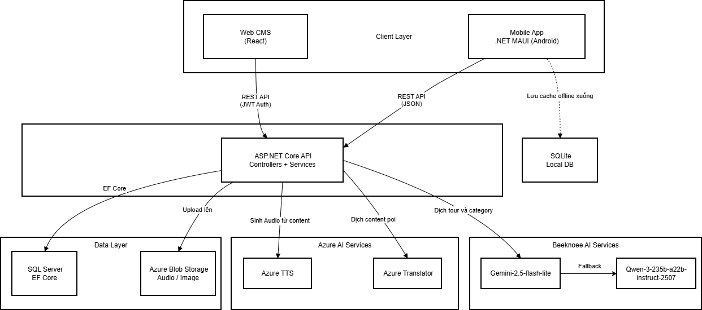

### 5.3. Sơ Đồ Cơ Sở Dữ Liệu (Schema & ERD)

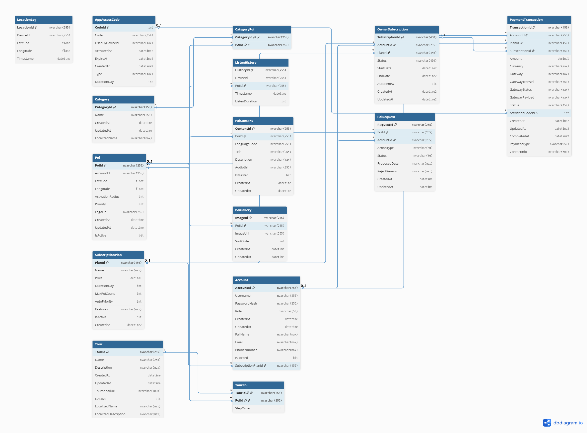

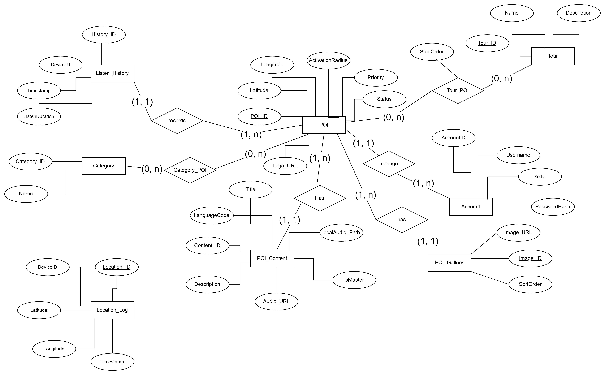

### 5.4. Sơ Đồ Lớp Nghiệp Vụ (Class Diagram)

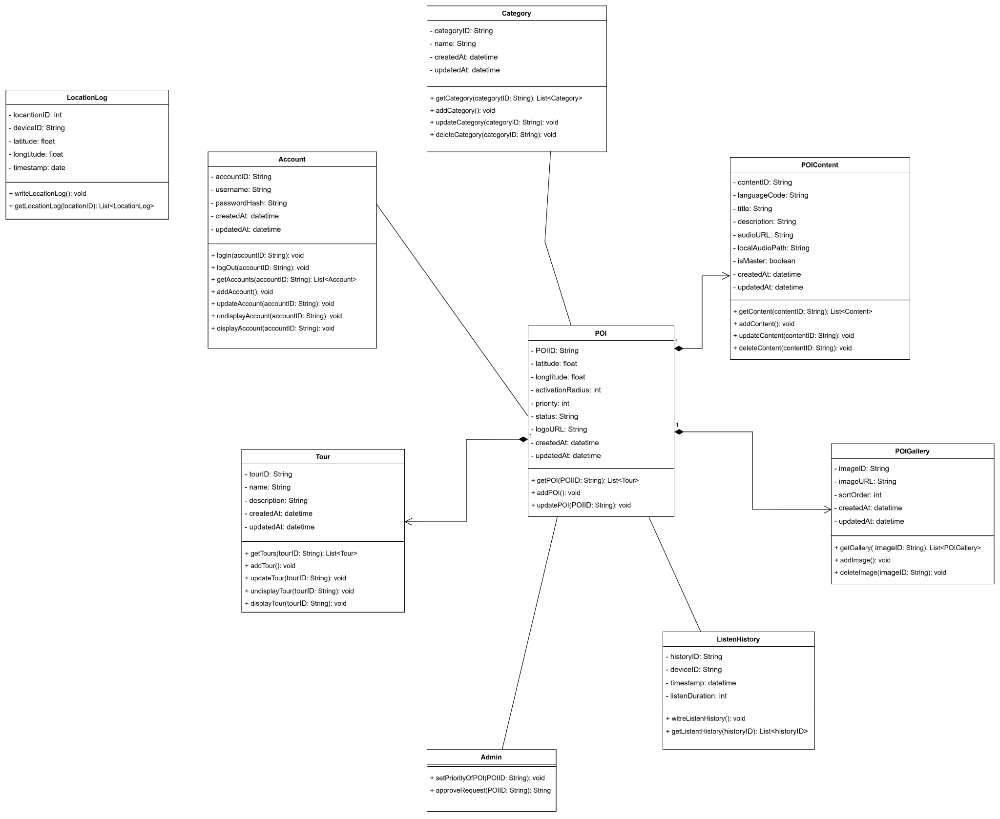

---

## 🗄️ 6. CƠ SỞ DỮ LIỆU (DATABASE SCHEMA)

> **15 bảng** trong SQL Server — phản ánh chính xác `api/Models/`.

| Bảng | Mô tả | Khóa chính |
| :--- | :--- | :--- |
| `Account` | Tài khoản Admin/Owner (username, passwordHash, role, fullName, email, phoneNumber, isLocked, subscriptionPlanId) | `AccountId` |
| `AppAccessCode` | Mã QR xác thực Mobile (code, usedByDeviceId, activatedAt, expireAt) | `CodeId` |
| `Poi` | Điểm quan tâm (lat, lon, activationRadius, priority, isActive, logoUrl) | `PoiId` |
| `PoiContent` | Nội dung đa ngôn ngữ (languageCode, title, description, audioUrl, isMaster) | `ContentId` |
| `PoiGallery` | Ảnh gallery (imageUrl, sortOrder) | `ImageId` |
| `PoiRequest` | Vùng đệm yêu cầu POI của Owner (actionType: CREATE/UPDATE/DELETE, status: PENDING/APPROVED/REJECTED, proposedData JSON) | `RequestId` |
| `Category` | Danh mục (name) | `CategoryId` |
| `CategoryPoi` | Bảng nối N-N Category ↔ POI | `CategoryId + PoiId` |
| `Tour` | Tour tham quan (name, localizedName JSON, localizedDescription JSON, thumbnailUrl, isActive) | `TourId` |
| `TourPoi` | Bảng nối Tour ↔ POI (stepOrder) | `TourId + PoiId` |
| `ListenHistory` | Lịch sử nghe (deviceId, poiId, listenDuration, timestamp) | `HistoryId` |
| `LocationLog` | GPS log (deviceId, lat, lon, timestamp) | `LocationId` |
| `SubscriptionPlan` | Gói đăng ký cho Owner (planId: basic/plus/professional/enterprise, price, durationDay, maxPoiCount, autoPriority, features JSON) | `PlanId` |
| `OwnerSubscription` | Gói đang kích hoạt của Owner (accountId FK, planId FK, status: ACTIVE/EXPIRED/CANCELLED, startDate, endDate) | `SubscriptionId` |
| `PaymentTransaction` | Lịch sử giao dịch thanh toán (paymentType: TOURIST_ACCESS/OWNER_SUBSCRIPTION, gateway: SEPAY/MOMO/MANUAL, status: PENDING/SUCCESS/FAILED/REFUNDED, amount, transactionId: AG-{ts}-{rand6}) | `TransactionId` |

**Chi tiết gói SubscriptionPlan:**

| PlanId | Tên | Giá (VNĐ) | Số POI tối đa | AutoPriority | Thời hạn |
| :--- | :--- | :--- | :--- | :--- | :--- |
| `basic` | Cơ bản | 199.000 | 1 | 1 (Thấp) | 30 ngày |
| `plus` | Nâng cao | 249.000 | 3 | 2 | 30 ngày |
| `professional` | Chuyên nghiệp | 499.000 | 5 | 3 | 30 ngày |
| `enterprise` | Doanh nghiệp | 999.000 | 10 | 4 (Cao) | 30 ngày |

> **Quy tắc Priority:** `AutoPriority` quyết định `Poi.Priority` khi POI được duyệt tạo mới. Khi subscription EXPIRED → tất cả POI của Owner bị hạ về `Priority = 1`.

---

## 🔗 7. DANH MỤC API ROUTES (.NET CORE)

> API chia 3 nhóm route: **Auth**, **CMS** (🔒 JWT required), **Mobile**.

### 🔐 Authentication

| Method | Route | Mô tả |
| :--- | :--- | :--- |
| `POST` | `/api/auth/login` | Đăng nhập (CMS Admin/Owner) |
| `POST` | `/api/auth/register` | Đăng ký tài khoản |
| `POST` | `/api/auth/setup-dev` | [DEV] Tạo/reset admin account |

### 🌐 Web CMS APIs (🔒 JWT Bearer)

#### POI Management
| Method | Route | Mô tả |
| :--- | :--- | :--- |
| `GET` | `/api/cms/pois` | Danh sách POI |
| `GET` | `/api/cms/pois/{id}` | Chi tiết POI kèm content + gallery |
| `POST` | `/api/cms/pois` | Tạo POI mới |
| `PUT` | `/api/cms/pois/{id}` | Cập nhật POI |
| `DELETE` | `/api/cms/pois/{id}` | Xóa POI |

#### POI Content (Multilingual)
| Method | Route | Mô tả |
| :--- | :--- | :--- |
| `GET` | `/api/cms/pois/{poiId}/content` | Danh sách content |
| `POST` | `/api/cms/pois/{poiId}/content` | Thêm bản ngôn ngữ mới |
| `PUT` | `/api/cms/pois/{poiId}/content/{contentId}` | Sửa content |
| `DELETE` | `/api/cms/pois/{poiId}/content/{contentId}` | Xóa bản content |

#### POI Gallery
| Method | Route | Mô tả |
| :--- | :--- | :--- |
| `GET` | `/api/cms/pois/{poiId}/gallery` | Danh sách ảnh gallery |
| `POST` | `/api/cms/pois/{poiId}/gallery` | Thêm ảnh |
| `DELETE` | `/api/cms/pois/{poiId}/gallery/{imageId}` | Xóa ảnh |

#### Media Upload
| Method | Route | Mô tả |
| :--- | :--- | :--- |
| `POST` | `/api/cms/upload/audio` | Upload audio (50MB max) |
| `POST` | `/api/cms/upload/image` | Upload ảnh (10MB max) |

#### Account Management
| Method | Route | Mô tả |
| :--- | :--- | :--- |
| `GET` | `/api/cms/accounts` | Danh sách tài khoản |
| `GET` | `/api/cms/accounts/{id}` | Chi tiết tài khoản |
| `POST` | `/api/cms/accounts` | Tạo tài khoản mới |
| `PUT` | `/api/cms/accounts/{id}` | Cập nhật tài khoản |
| `DELETE` | `/api/cms/accounts/{id}` | Xóa tài khoản |

#### Category Management
| Method | Route | Mô tả |
| :--- | :--- | :--- |
| `GET` | `/api/cms/categories` | Danh sách danh mục |
| `GET` | `/api/cms/categories/{id}` | Chi tiết |
| `POST` | `/api/cms/categories` | Tạo danh mục |
| `PUT` | `/api/cms/categories/{id}` | Sửa |
| `DELETE` | `/api/cms/categories/{id}` | Xóa |
| `POST` | `/api/cms/categories/{id}/pois` | Gán POI |
| `DELETE` | `/api/cms/categories/{id}/pois/{poiId}` | Bỏ POI |

#### Tour Management (Lộ Trình Tham Quan)
| Method | Route | Mô tả |
| :--- | :--- | :--- |
| `GET` | `/api/cms/tours` | Danh sách tour (thêm `?includeInactive=true` để Admin xem cả ẩn) |
| `GET` | `/api/cms/tours/{id}` | Chi tiết tour |
| `POST` | `/api/cms/tours` | Tạo tour mới (tự dịch 7 ngôn ngữ) |
| `PUT` | `/api/cms/tours/{id}` | Sửa tour (regenerate localization nếu đổi tên) |
| `DELETE` | `/api/cms/tours/{id}` | Soft-delete (isActive=false) |
| `PATCH` | `/api/cms/tours/{id}/restore` | Khôi phục tour đã ẩn |
| `POST` | `/api/cms/tours/{id}/pois` | Thêm POI (kèm stepOrder) |
| `DELETE` | `/api/cms/tours/{id}/pois/{poiId}` | Xóa POI khỏi tour |
| `PUT` | `/api/cms/tours/{id}/pois/{poiId}/order` | Đổi thứ tự bước |

#### Content Pipeline
| Method | Route | Mô tả |
| :--- | :--- | :--- |
| `POST` | `/api/cms/pipeline/generate/{poiId}` | Generate audio cho 1 POI |
| `POST` | `/api/cms/pipeline/generate-all` | Generate audio batch |
| `POST` | `/api/cms/pipeline/generate-all-languages` | **Full Pipeline**: Dịch + TTS × 7 langs |
| `GET` | `/api/cms/pipeline/status` | Trạng thái pipeline |

#### Analytics
| Method | Route | Mô tả |
| :--- | :--- | :--- |
| `GET` | `/api/cms/analytics/top-pois?top=N` | Top POI được nghe nhiều |
| `GET` | `/api/cms/analytics/heatmap` | Heatmap vị trí |
| `GET` | `/api/cms/analytics/device-activity?deviceId=&days=` | Timeline GPS + listen history của 1 thiết bị |

#### Access Code Management (Admin)
| Method | Route | Mô tả |
| :--- | :--- | :--- |
| `GET` | `/api/cms/accesscodes?page=&pageSize=` | Danh sách QR access codes (phân trang) |
| `POST` | `/api/cms/accesscodes` | Tạo batch mã QR (`{ count }`) |
| `DELETE` | `/api/cms/accesscodes/{id}` | Xóa mã QR |

#### CMS Location Log (Admin)
| Method | Route | Mô tả |
| :--- | :--- | :--- |
| `GET` | `/api/cms/location-logs` | Danh sách GPS log (filter deviceId, date) |
| `DELETE` | `/api/cms/location-logs/{id}` | Xóa log entry |

#### CMS Translation
| Method | Route | Mô tả |
| :--- | :--- | :--- |
| `POST` | `/api/cms/translation/translate` | Dịch văn bản qua Azure Translator |

#### Real-Time Hub (SignalR)
| Endpoint | Giao thức | Mô tả |
| :--- | :--- | :--- |
| `/deviceHub` | WebSocket (SignalR) | Hub theo dõi thiết bị real-time |
| ↳ `OnConnectedAsync` | Event | Mobile → đăng ký online; Admin → join group `admin_dashboard` |
| ↳ `SendLocationUpdate(lat, lon)` | Mobile→Server | Gửi GPS real-time, lưu LocationLog qua Queue |
| ↳ `GetActiveDevices()` | Web→Server | Snapshot danh sách thiết bị đang online |
| ↳ `DeviceOnline / DeviceOffline` | Server→Web | Broadcast khi thiết bị kết nối/ngắt |
| ↳ `LocationUpdated` | Server→Web | Broadcast vị trí GPS mới tới admin dashboard |

#### POI Request (Owner submit — Admin review)
| Method | Route | Mô tả |
| :--- | :--- | :--- |
| `GET` | `/api/cms/pois/requests/my-requests?status=` | Owner xem request của mình |
| `GET` | `/api/cms/pois/requests/{requestId}` | Chi tiết request + proposedData JSON |
| `POST` | `/api/cms/pois/requests` | Owner gửi request CREATE/UPDATE/DELETE |
| `GET` | `/api/cms/pois/requests?status=PENDING` | Admin xem tất cả request |
| `GET` | `/api/cms/pois/requests/stats` | Admin xem thống kê PENDING theo ActionType |
| `PUT` | `/api/cms/pois/requests/{requestId}/review` | Admin phê duyệt/từ chối |

#### Subscription & Pricing Plans
| Method | Route | Mô tả |
| :--- | :--- | :--- |
| `GET` | `/api/cms/subscriptions/plans` | Danh sách gói (Owner: chỉ active; Admin: tất cả) |
| `POST` | `/api/cms/subscriptions/plans` | Admin tạo gói mới |
| `PUT` | `/api/cms/subscriptions/plans/{planId}` | Admin sửa gói |
| `PUT` | `/api/cms/subscriptions/plans/{planId}/toggle` | Admin ẩn/hiện gói |
| `GET` | `/api/cms/subscriptions/me` | Owner xem gói hiện tại + ngày hết hạn |
| `POST` | `/api/cms/subscriptions/upgrade/init` | Owner khởi tạo nâng gói (VietQR/MoMo) |
| `GET` | `/api/cms/subscriptions/owner/{accountId}` | Admin xem subscription của Owner |
| `POST` | `/api/cms/subscriptions/owner/{accountId}/assign` | Admin gán gói thủ công (MANUAL) |
| `GET` | `/api/cms/subscriptions/upgrade/verify?transactionId=` | Owner poll kết quả thanh toán |

#### Debug & Simulator Tools (Admin Only)
| Method | Route | Mô tả |
| :--- | :--- | :--- |
| `POST` | `/api/cms/debug/geofence-simulate` | Giả lập tranh chấp Geofence — 3-Tier conflict resolution với CustomPois hoặc DB |

#### Payment Management (Admin)
| Method | Route | Mô tả |
| :--- | :--- | :--- |
| `GET` | `/api/cms/payments` | Danh sách giao dịch (filter type, status, date) |
| `GET` | `/api/cms/payments/{transactionId}` | Chi tiết giao dịch |

#### Payment Webhooks (SePay / MoMo)
| Method | Route | Mô tả |
| :--- | :--- | :--- |
| `POST` | `/api/payment/sepay/webhook` | SePay callback — cập nhật PaymentTransaction |
| `POST` | `/api/payment/momo/webhook` | MoMo callback — cập nhật PaymentTransaction |

### 📱 Mobile APIs

| Method | Route | Mô tả |
| :--- | :--- | :--- |
| `POST` | `/api/mobile/auth/scan-qr` | Quét QR kích hoạt app |
| `GET` | `/api/mobile/pois?lang=vi` | Danh sách POI |
| `GET` | `/api/mobile/pois/nearby?lat=&lon=&radius=` | POI gần vị trí |
| `GET` | `/api/mobile/pois/{poiId}?lang=vi` | Chi tiết POI |
| `GET` | `/api/mobile/categories` | Danh sách danh mục |
| `GET` | `/api/mobile/tours?lang=vi` | Danh sách tour |
| `GET` | `/api/mobile/tours/{tourId}?lang=vi` | Chi tiết tour + steps |
| `POST` | `/api/mobile/listen-history` | Ghi lịch sử nghe |
| `POST` | `/api/mobile/location-log` | Gửi batch GPS log |
| `POST` | `/api/mobile/payment/init` | Du khách khởi tạo thanh toán VietQR |
| `GET` | `/api/mobile/payment/verify?transactionId=&deviceId=` | Poll trạng thái thanh toán |
| `GET` | `/api/mobile/tours/directions?waypoints=&mode=` | Lấy đường đi (ORS OpenRouteService) |

---

## 🖥️ 8. WEB CMS — CẤU TRÚC TRANG (REACT ROUTES)

> Web CMS sử dụng React Router v6 với `ProtectedRoute` kiểm tra role JWT.
> File pages: `web/src/pages/` — **27 trang** hiện tại.

**Quản lý POI & Nội dung**

| Route | Trang | Quyền | Mô tả |
| :--- | :--- | :--- | :--- |
| `/` | `LoginPage` | Public | Đăng nhập CMS |
| `/dashboard` | `DashboardPage` | Admin, Owner | Tổng quan thống kê (Top POI, Heatmap, Online devices) |
| `/pois` | `POIPage` | Admin, Owner | Danh sách POI + filter/search/sort |
| `/pois/add` | `AddPOIPage` | Owner | Form tạo POI mới (gửi PoiRequest CREATE) |
| `/pois/:id` | `POIDetailPage` | Admin, Owner | Chi tiết: content, gallery, pipeline trigger |
| `/pois/:id/update` | `POIUpdateDetailPage` | Owner | Form sửa POI (gửi PoiRequest UPDATE) |
| `/audio` | `AudioPage` | Admin, Owner | Quản lý audio files |
| `/audio/:poiId` | `AudioContentPage` | Admin, Owner | Nội dung audio chi tiết của POI |

**Duyệt POI Request (Admin Workflow)**

| Route | Trang | Quyền | Mô tả |
| :--- | :--- | :--- | :--- |
| `/poi-management` | `POIManagementPage` | Admin | Tổng quan 3 cột: New / Update / Delete requests |
| `/poi-management/new` | `POINewListPage` | Admin | Danh sách request TẠO MỚI đang PENDING |
| `/poi-management/update` | `POIUpdateListPage` | Admin | Danh sách request CẬP NHẬT đang PENDING |
| `/poi-management/delete` | `POIDeletionListPage` | Admin | Danh sách request XÓA đang PENDING |

**Quản trị & Monitoring**

| Route | Trang | Quyền | Mô tả |
| :--- | :--- | :--- | :--- |
| `/accounts` | `AccountsPage` | Admin | CRUD tài khoản Owner/Admin |
| `/categories` | `CategoryPage` | Admin | CRUD danh mục POI |
| `/tours` | `ToursPage` | Admin | Danh sách Tour |
| `/tours/create` | `CreateTourPage` | Admin | Tạo Tour mới + gán POI steps |
| `/tours/:id` | `TourDetailPage` | Admin | Chi tiết Tour: quản lý steps và thứ tự |
| `/analytics` | `AnalyticsPage` | Admin | Phân tích dữ liệu nâng cao |
| `/access-codes` | `AccessCodePage` | Admin | Quản lý mã QR kích hoạt |
| `/device-tracking` | `DeviceTrackingPage` | Admin | Real-time map vị trí thiết bị (SignalR) |
| `/device-activity` | `DeviceActivityPage` | Admin | Timeline GPS + lịch sử nghe của thiết bị |
| `/queue-demo` | `QueueDemoPage` | Admin | Dev tool test SignalR queue |

**Subscription & Thanh Toán**

| Route | Trang | Quyền | Mô tả |
| :--- | :--- | :--- | :--- |
| `/pricing` | `PricingPlansPage` | Owner | Xem các gói dịch vụ và so sánh |
| `/subscriptions/checkout` | `SubscriptionCheckoutPage` | Owner | Thanh toán nâng gói (VietQR/MoMo, hiển thị QR chuyển khoản) |
| `/subscriptions` | `AdminSubscriptionDashboard` | Admin | Quản lý subscription của tất cả Owner |
| `/transactions` | `AdminTransactionDashboard` | Admin | Lịch sử giao dịch thanh toán |
| `/profile` | `ProfilePage` | Admin, Owner | Xem/sửa thông tin cá nhân |

---

## 📊 9. SƠ ĐỒ USECASE (USE CASE DIAGRAMS)

### 9.1. Usecase — Du Khách (Guest / Mobile App)

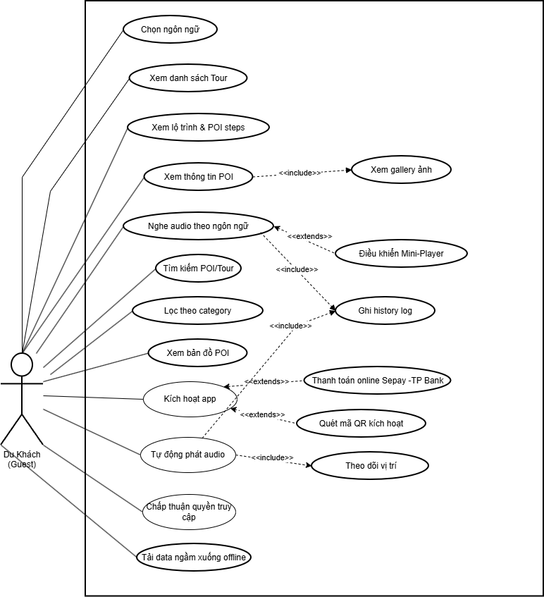

### 9.2. Usecase — Chủ Quán (POI Owner / Web CMS)


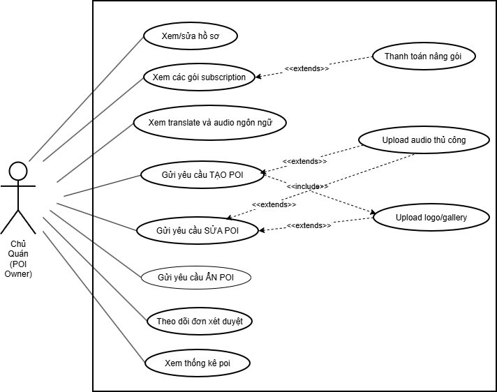


### 9.3. Usecase — Admin 


## 🔄 10. SƠ ĐỒ TRÌNH TỰ (SEQUENCE DIAGRAMS)

### 10.1. Xem Màn Hình Chào (📱 Mobile — UC1)

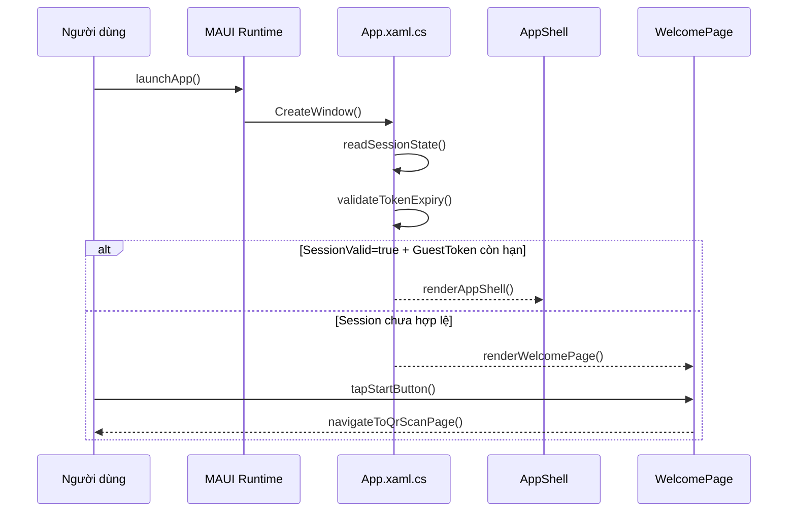
```mermaid
sequenceDiagram
    participant MobileUser as Người dùng
    participant Runtime as MAUI Runtime
    participant App as App.xaml.cs
    participant Shell as AppShell
    participant Welcome as WelcomePage
    
    MobileUser ->> Runtime: launchApp()
    Runtime ->> App: CreateWindow()
    App ->> App: readSessionState()
    App ->> App: validateTokenExpiry()
    
    alt SessionValid=true + GuestToken còn hạn
        App -->> Shell: renderAppShell()
    else Session chưa hợp lệ
        App -->> Welcome: renderWelcomePage()
        MobileUser ->> Welcome: tapStartButton()
        Welcome -->> MobileUser: navigateToQrScanPage()
    end
```

---

### 10.2. Quét QR Kích Hoạt (📱 Mobile — UC2)

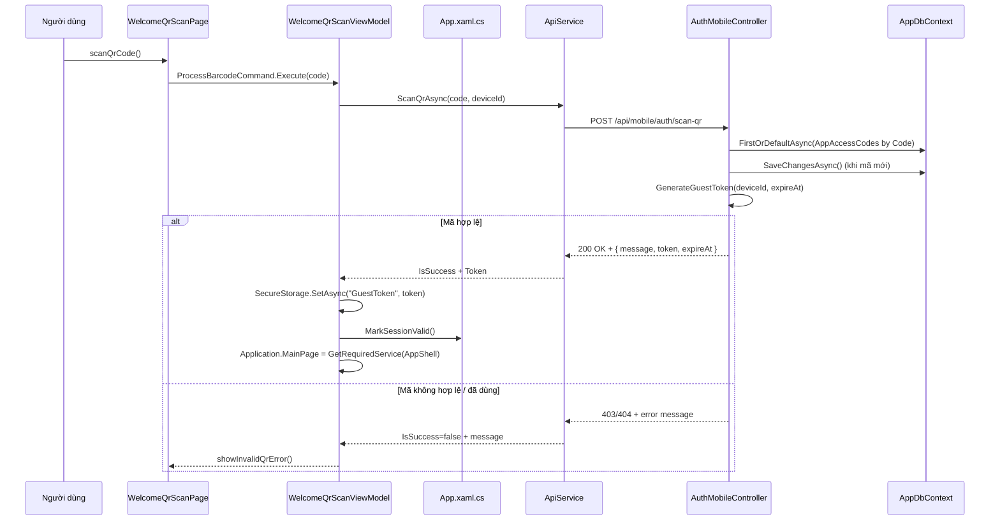
```mermaid
sequenceDiagram
    participant MobileUser as Người dùng
    participant QrPage as WelcomeQrScanPage
    participant VM as WelcomeQrScanViewModel
    participant App as App.xaml.cs
    participant API as ApiService
    participant AuthCtrl as AuthMobileController
    participant DB as AppDbContext

    MobileUser ->> QrPage: scanQrCode()
    QrPage ->> VM: ProcessBarcodeCommand.Execute(code)
    VM ->> API: ScanQrAsync(code, deviceId)
    API ->> AuthCtrl: POST /api/mobile/auth/scan-qr
    AuthCtrl ->> DB: FirstOrDefaultAsync(AppAccessCodes by Code)
    AuthCtrl ->> DB: SaveChangesAsync() (khi mã mới)
    AuthCtrl ->> AuthCtrl: GenerateGuestToken(deviceId, expireAt)

    alt Mã hợp lệ
        AuthCtrl -->> API: 200 OK + { message, token, expireAt }
        API -->> VM: IsSuccess + Token
        VM ->> VM: SecureStorage.SetAsync("GuestToken", token)
        VM ->> App: MarkSessionValid()
        VM ->> VM: Application.MainPage = GetRequiredService(AppShell)
    else Mã không hợp lệ / đã dùng
        AuthCtrl -->> API: 403/404 + error message
        API -->> VM: IsSuccess=false + message
        VM -->> QrPage: showInvalidQrError()
    end
```

---

### 10.3. Đồng Bộ Dữ Liệu Lần Đầu (📱 Mobile — UC3)

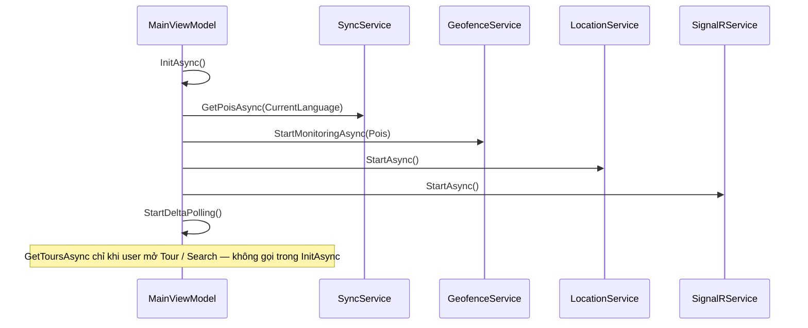
```mermaid
sequenceDiagram
    participant MainVM as MainViewModel
    participant SyncSvc as SyncService
    participant GeoSvc as GeofenceService
    participant LocSvc as LocationService
    participant SigR as SignalRService

    MainVM ->> MainVM: InitAsync()
    MainVM ->> SyncSvc: GetPoisAsync(CurrentLanguage)
    MainVM ->> GeoSvc: StartMonitoringAsync(Pois)
    MainVM ->> LocSvc: StartAsync()
    MainVM ->> SigR: StartAsync()
    MainVM ->> MainVM: StartDeltaPolling()
    Note over MainVM: GetToursAsync chỉ khi user mở Tour / Search — không gọi trong InitAsync
```

---

### 10.4. Xem Bản Đồ POI (📱 Mobile — UC4)

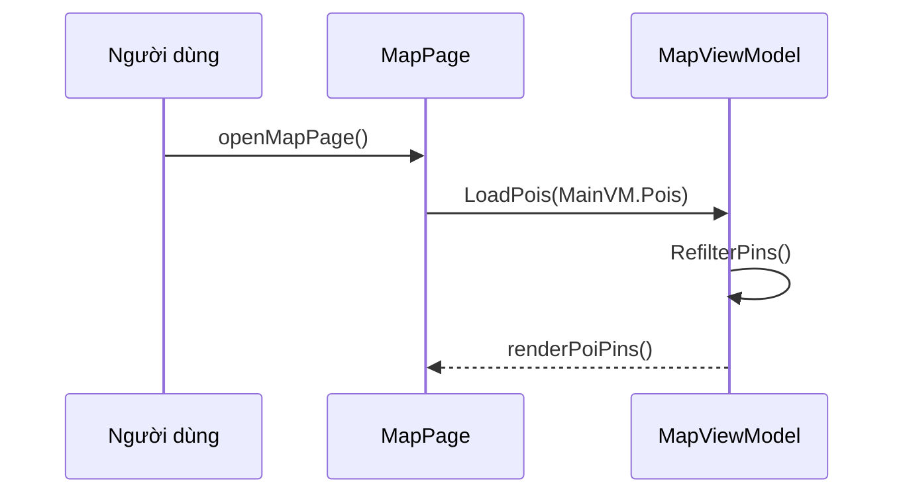
```mermaid
sequenceDiagram
    participant MobileUser as Người dùng
    participant MapPage
    participant MapVM as MapViewModel
    

    MobileUser ->> MapPage: openMapPage()
    MapPage ->> MapVM: LoadPois(MainVM.Pois)
    MapVM ->> MapVM: RefilterPins()
    MapVM -->> MapPage: renderPoiPins()
```

---

### 10.5. Theo Dõi Vị Trí & Tự Động Phát Audio — Geofence (📱 Mobile — UC5)


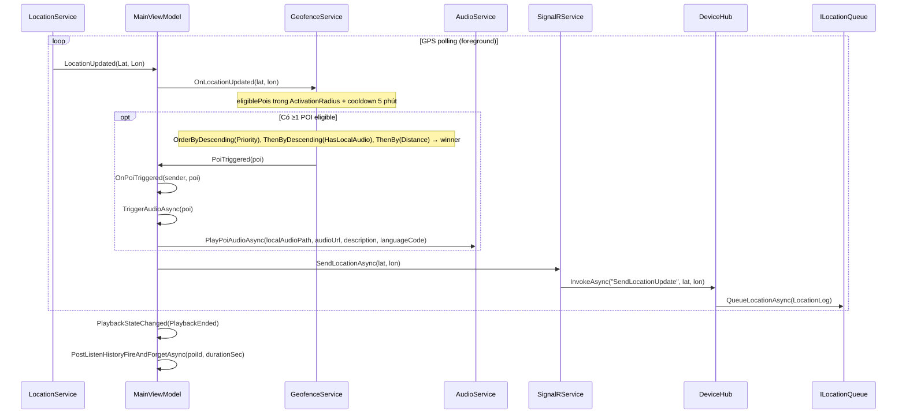
```mermaid
sequenceDiagram
    participant LocSvc as LocationService
    participant MainVM as MainViewModel
    participant GeoSvc as GeofenceService
    participant AudioSvc as AudioService
    participant SigR as SignalRService
    participant Hub as DeviceHub
    participant LocQ as ILocationQueue

    loop GPS polling (foreground)
        LocSvc ->> MainVM: LocationUpdated(Lat, Lon)
        MainVM ->> GeoSvc: OnLocationUpdated(lat, lon)
        Note over GeoSvc: eligiblePois trong ActivationRadius + cooldown 5 phút
        opt Có ≥1 POI eligible
            Note over GeoSvc: OrderByDescending(Priority), ThenByDescending(HasLocalAudio), ThenBy(Distance) → winner
            GeoSvc ->> MainVM: PoiTriggered(poi)
            MainVM ->> MainVM: OnPoiTriggered(sender, poi)
            MainVM ->> MainVM: TriggerAudioAsync(poi)
            MainVM ->> AudioSvc: PlayPoiAudioAsync(localAudioPath, audioUrl, description, languageCode)
        end
        MainVM ->> SigR: SendLocationAsync(lat, lon)
        SigR ->> Hub: InvokeAsync("SendLocationUpdate", lat, lon)
        Hub ->> LocQ: QueueLocationAsync(LocationLog)
    end

    MainVM ->> MainVM: PlaybackStateChanged(PlaybackEnded)
    MainVM ->> MainVM: PostListenHistoryFireAndForgetAsync(poiId, durationSec)
```

---

### 10.6. Điều Khiển Mini-Player (📱 Mobile — UC6)


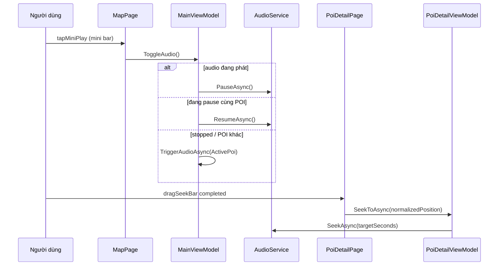
```mermaid
sequenceDiagram
    participant MobileUser as Người dùng
    participant MapPage
    participant MainVM as MainViewModel
    participant AudioSvc as AudioService
    participant DetailPage as PoiDetailPage
    participant DetailVM as PoiDetailViewModel

    MobileUser ->> MapPage: tapMiniPlay (mini bar)
    MapPage ->> MainVM: ToggleAudio()
    alt audio đang phát
        MainVM ->> AudioSvc: PauseAsync()
    else đang pause cùng POI
        MainVM ->> AudioSvc: ResumeAsync()
    else stopped / POI khác
        MainVM ->> MainVM: TriggerAudioAsync(ActivePoi)
    end

    MobileUser ->> DetailPage: dragSeekBar completed
    DetailPage ->> DetailVM: SeekToAsync(normalizedPosition)
    DetailVM ->> AudioSvc: SeekAsync(targetSeconds)
```

---

### 10.7. Tìm Kiếm POI (📱 Mobile — UC7)


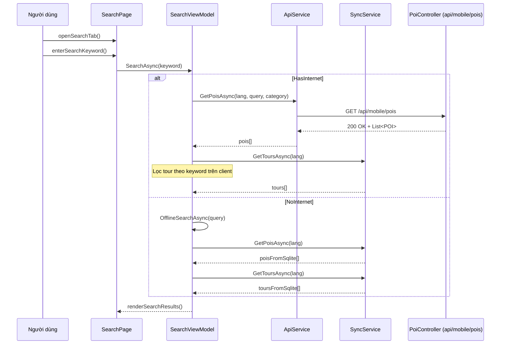
```mermaid
sequenceDiagram
    participant MobileUser as Người dùng
    participant SearchPage
    participant SearchVM as SearchViewModel
    participant API as ApiService
    participant SyncSvc as SyncService
    participant PoiCtrl as PoiController (api/mobile/pois)

    MobileUser ->> SearchPage: openSearchTab()
    MobileUser ->> SearchPage: enterSearchKeyword()
    SearchPage ->> SearchVM: SearchAsync(keyword)

    alt HasInternet
        SearchVM ->> API: GetPoisAsync(lang, query, category)
        API ->> PoiCtrl: GET /api/mobile/pois
        PoiCtrl -->> API: 200 OK + List<POI>
        API -->> SearchVM: pois[]
        SearchVM ->> SyncSvc: GetToursAsync(lang)
        Note over SearchVM: Lọc tour theo keyword trên client
        SyncSvc -->> SearchVM: tours[]
    else NoInternet
        SearchVM ->> SearchVM: OfflineSearchAsync(query)
        SearchVM ->> SyncSvc: GetPoisAsync(lang)
        SyncSvc -->> SearchVM: poisFromSqlite[]
        SearchVM ->> SyncSvc: GetToursAsync(lang)
        SyncSvc -->> SearchVM: toursFromSqlite[]
    end

    SearchVM -->> SearchPage: renderSearchResults()
```

---

### 10.8. Lọc POI Theo Category (📱 Mobile — UC8)


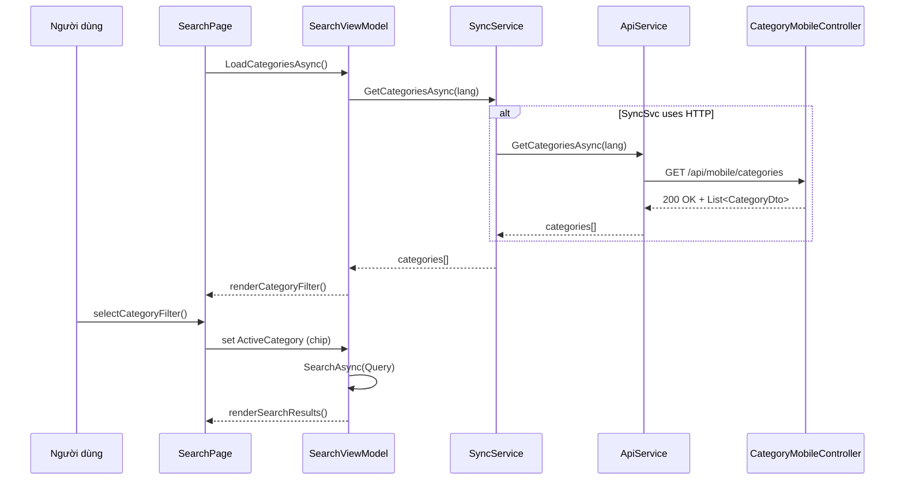
```mermaid
sequenceDiagram
    participant MobileUser as Người dùng
    participant SearchPage
    participant SearchVM as SearchViewModel
    participant SyncSvc as SyncService
    participant API as ApiService
    participant CatCtrl as CategoryMobileController

    SearchPage ->> SearchVM: LoadCategoriesAsync()
    SearchVM ->> SyncSvc: GetCategoriesAsync(lang)
    alt SyncSvc uses HTTP
        SyncSvc ->> API: GetCategoriesAsync(lang)
        API ->> CatCtrl: GET /api/mobile/categories
        CatCtrl -->> API: 200 OK + List<CategoryDto>
        API -->> SyncSvc: categories[]
    end
    SyncSvc -->> SearchVM: categories[]
    SearchVM -->> SearchPage: renderCategoryFilter()

    MobileUser ->> SearchPage: selectCategoryFilter()
    SearchPage ->> SearchVM: set ActiveCategory (chip)
    SearchVM ->> SearchVM: SearchAsync(Query)
    SearchVM -->> SearchPage: renderSearchResults()
```

---

### 10.9. Xem Thông Tin POI (📱 Mobile — UC9)


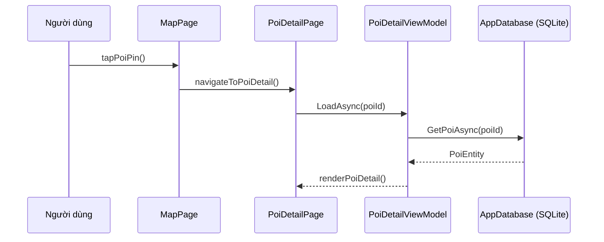
```mermaid
sequenceDiagram
    participant MobileUser as Người dùng
    participant MapPage
    participant DetailPage as PoiDetailPage
    participant DetailVM as PoiDetailViewModel
    participant DB as AppDatabase (SQLite)

    MobileUser ->> MapPage: tapPoiPin()
    MapPage ->> DetailPage: navigateToPoiDetail()
    DetailPage ->> DetailVM: LoadAsync(poiId)
    DetailVM ->> DB: GetPoiAsync(poiId)
    DB -->> DetailVM: PoiEntity
    DetailVM -->> DetailPage: renderPoiDetail()
```

---

### 10.10. Xem Gallery Ảnh (📱 Mobile — UC10)

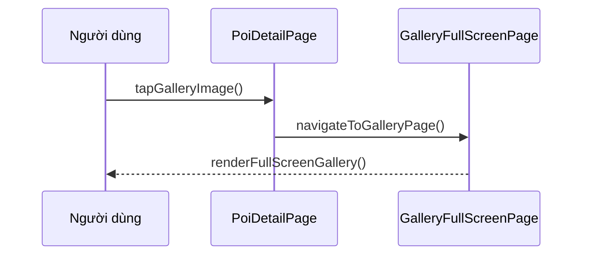
```mermaid
sequenceDiagram
    participant MobileUser as Người dùng
    participant DetailPage as PoiDetailPage
    participant GalleryPage as GalleryFullScreenPage

    MobileUser ->> DetailPage: tapGalleryImage()
    DetailPage ->> GalleryPage: navigateToGalleryPage()
    GalleryPage -->> MobileUser: renderFullScreenGallery()
```

---

### 10.11. Nghe Audio Theo Ngôn Ngữ (📱 Mobile — UC11)


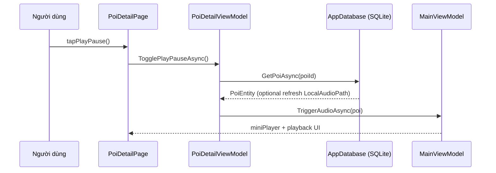
```mermaid
sequenceDiagram
    participant MobileUser as Người dùng
    participant DetailPage as PoiDetailPage
    participant DetailVM as PoiDetailViewModel
    participant DB as AppDatabase (SQLite)
    participant MainVM as MainViewModel

    MobileUser ->> DetailPage: tapPlayPause()
    DetailPage ->> DetailVM: TogglePlayPauseAsync()
    DetailVM ->> DB: GetPoiAsync(poiId)
    DB -->> DetailVM: PoiEntity (optional refresh LocalAudioPath)
    DetailVM ->> MainVM: TriggerAudioAsync(poi)
    MainVM -->> DetailPage: miniPlayer + playback UI
```

---

### 10.12. Xem Danh Sách Tour (📱 Mobile — UC12)


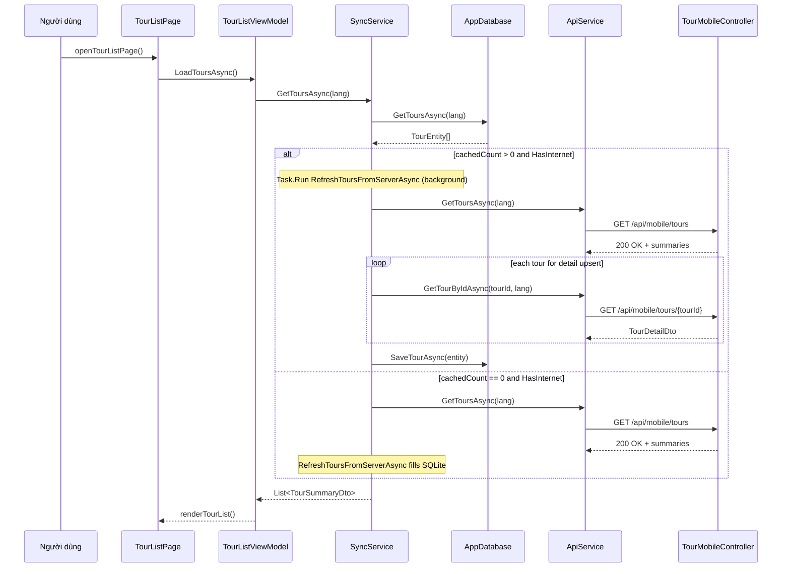
```mermaid
sequenceDiagram
    participant User as Người dùng
    participant TourListPage
    participant TourListVM as TourListViewModel
    participant SyncSvc as SyncService
    participant SQLite as AppDatabase
    participant API as ApiService
    participant TourCtrl as TourMobileController

    User ->> TourListPage: openTourListPage()
    TourListPage ->> TourListVM: LoadToursAsync()
    TourListVM ->> SyncSvc: GetToursAsync(lang)
    SyncSvc ->> SQLite: GetToursAsync(lang)
    SQLite -->> SyncSvc: TourEntity[]

    alt cachedCount > 0 and HasInternet
        Note over SyncSvc: Task.Run RefreshToursFromServerAsync (background)
        SyncSvc ->> API: GetToursAsync(lang)
        API ->> TourCtrl: GET /api/mobile/tours
        TourCtrl -->> API: 200 OK + summaries
        loop each tour for detail upsert
            SyncSvc ->> API: GetTourByIdAsync(tourId, lang)
            API ->> TourCtrl: GET /api/mobile/tours/{tourId}
            TourCtrl -->> API: TourDetailDto
        end
        SyncSvc ->> SQLite: SaveTourAsync(entity)
    else cachedCount == 0 and HasInternet
        SyncSvc ->> API: GetToursAsync(lang)
        API ->> TourCtrl: GET /api/mobile/tours
        TourCtrl -->> API: 200 OK + summaries
        Note over SyncSvc: RefreshToursFromServerAsync fills SQLite
    end

    SyncSvc -->> TourListVM: List<TourSummaryDto>
    TourListVM -->> TourListPage: renderTourList()
```

---

### 10.13. Xem Chi Tiết Tour & Các Bước POI (📱 Mobile — UC13)


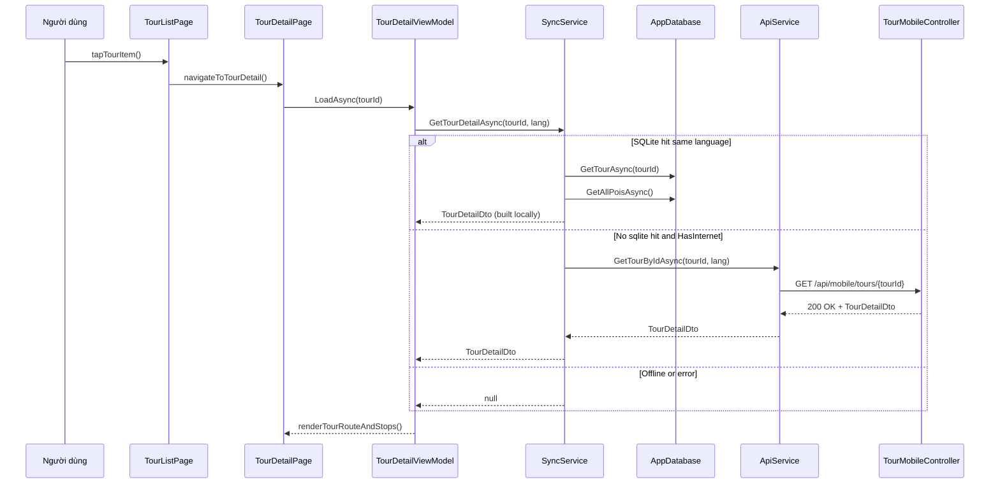
```mermaid
sequenceDiagram
    participant User as Người dùng
    participant TourListPage
    participant TourDetailPage
    participant TourDetailVM as TourDetailViewModel
    participant SyncSvc as SyncService
    participant SQLite as AppDatabase
    participant API as ApiService
    participant TourCtrl as TourMobileController

    User ->> TourListPage: tapTourItem()
    TourListPage ->> TourDetailPage: navigateToTourDetail()
    TourDetailPage ->> TourDetailVM: LoadAsync(tourId)
    TourDetailVM ->> SyncSvc: GetTourDetailAsync(tourId, lang)

    alt SQLite hit same language
        SyncSvc ->> SQLite: GetTourAsync(tourId)
        SyncSvc ->> SQLite: GetAllPoisAsync()
        SyncSvc -->> TourDetailVM: TourDetailDto (built locally)
    else No sqlite hit and HasInternet
        SyncSvc ->> API: GetTourByIdAsync(tourId, lang)
        API ->> TourCtrl: GET /api/mobile/tours/{tourId}
        TourCtrl -->> API: 200 OK + TourDetailDto
        API -->> SyncSvc: TourDetailDto
        SyncSvc -->> TourDetailVM: TourDetailDto
    else Offline or error
        SyncSvc -->> TourDetailVM: null
    end

    TourDetailVM -->> TourDetailPage: renderTourRouteAndStops()
```

---

### 10.14. Chọn Ngôn Ngữ (📱 Mobile — UC14)


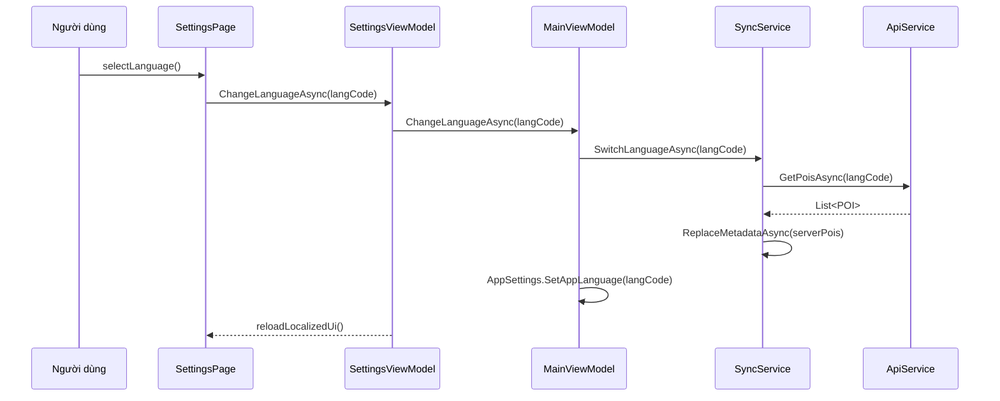
```mermaid
sequenceDiagram
    participant User as Người dùng
    participant SettingsPage
    participant SettingsVM as SettingsViewModel
    participant MainVM as MainViewModel
    participant SyncSvc as SyncService
    participant API as ApiService

    User ->> SettingsPage: selectLanguage()
    SettingsPage ->> SettingsVM: ChangeLanguageAsync(langCode)
    SettingsVM ->> MainVM: ChangeLanguageAsync(langCode)
    MainVM ->> SyncSvc: SwitchLanguageAsync(langCode)
    SyncSvc ->> API: GetPoisAsync(langCode)
    API -->> SyncSvc: List<POI>
    SyncSvc ->> SyncSvc: ReplaceMetadataAsync(serverPois)
    MainVM ->> MainVM: AppSettings.SetAppLanguage(langCode)
    SettingsVM -->> SettingsPage: reloadLocalizedUi()
```

---

### 10.15. Đồng Bộ Dữ Liệu Khi Đang Sử Dụng (📱 Mobile — UC15)


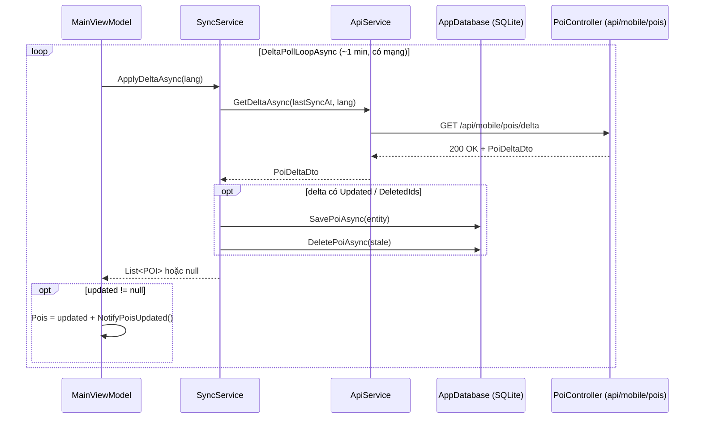
```mermaid
sequenceDiagram
    participant MainVM as MainViewModel
    participant SyncSvc as SyncService
    participant API as ApiService
    participant SQLite as AppDatabase (SQLite)
    participant PoiCtrl as PoiController (api/mobile/pois)

    loop DeltaPollLoopAsync (~1 min, có mạng)
        MainVM ->> SyncSvc: ApplyDeltaAsync(lang)
        SyncSvc ->> API: GetDeltaAsync(lastSyncAt, lang)
        API ->> PoiCtrl: GET /api/mobile/pois/delta
        PoiCtrl -->> API: 200 OK + PoiDeltaDto
        API -->> SyncSvc: PoiDeltaDto
        opt delta có Updated / DeletedIds
            SyncSvc ->> SQLite: SavePoiAsync(entity)
            SyncSvc ->> SQLite: DeletePoiAsync(stale)
        end
        SyncSvc -->> MainVM: List<POI> hoặc null
        opt updated != null
            MainVM ->> MainVM: Pois = updated + NotifyPoisUpdated()
        end
    end
```

---

### 10.18a. Thanh Toán Du Khách — Khởi Tạo (📱 Mobile — UC18)

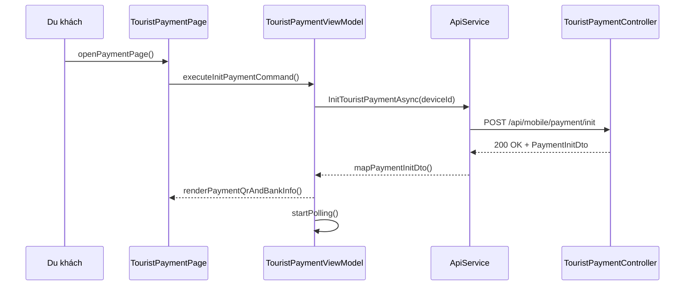
```mermaid
sequenceDiagram
    participant User as Du khách
    participant PayPage as TouristPaymentPage
    participant PayVM as TouristPaymentViewModel
    participant API as ApiService
    participant PayCtrl as TouristPaymentController

    User ->> PayPage: openPaymentPage()
    PayPage ->> PayVM: executeInitPaymentCommand()
    PayVM ->> API: InitTouristPaymentAsync(deviceId)
    API ->> PayCtrl: POST /api/mobile/payment/init
    PayCtrl -->> API: 200 OK + PaymentInitDto
    API -->> PayVM: mapPaymentInitDto()
    PayVM -->> PayPage: renderPaymentQrAndBankInfo()
    PayVM ->> PayVM: startPolling()
```

---

### 10.18b. Thanh Toán Du Khách — Xác Nhận & Cấp Token (📱 Mobile — UC18)

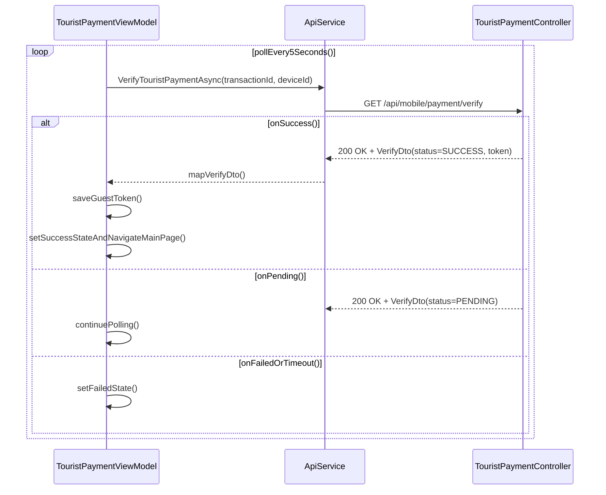
```mermaid
sequenceDiagram
    participant PayVM as TouristPaymentViewModel
    participant API as ApiService
    participant PayCtrl as TouristPaymentController

    loop pollEvery5Seconds()
        PayVM ->> API: VerifyTouristPaymentAsync(transactionId, deviceId)
        API ->> PayCtrl: GET /api/mobile/payment/verify

        alt onSuccess()
            PayCtrl -->> API: 200 OK + VerifyDto(status=SUCCESS, token)
            API -->> PayVM: mapVerifyDto()
            PayVM ->> PayVM: saveGuestToken()
            PayVM ->> PayVM: setSuccessStateAndNavigateMainPage()
        else onPending()
            PayCtrl -->> API: 200 OK + VerifyDto(status=PENDING)
            PayVM ->> PayVM: continuePolling()
        else onFailedOrTimeout()
            PayVM ->> PayVM: setFailedState()
        end
    end
```


### 10.20. CMS — Đăng Nhập (🌐 Web CMS — UC20)


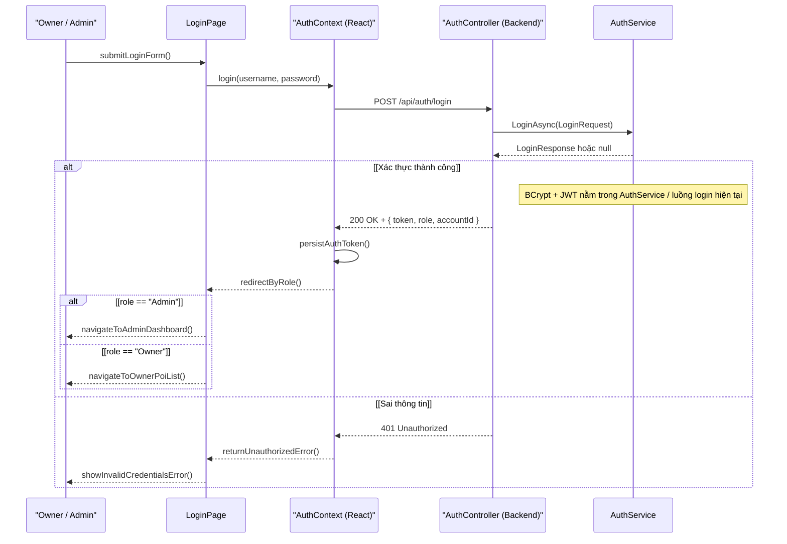
```mermaid
sequenceDiagram
    participant User as "Owner / Admin"
    participant LoginPage
    participant AuthCtx as "AuthContext (React)"
    participant AuthCtrl as "AuthController (Backend)"
    participant AuthSvc as AuthService

    User ->> LoginPage: submitLoginForm()
    LoginPage ->> AuthCtx: login(username, password)
    AuthCtx ->> AuthCtrl: POST /api/auth/login
    AuthCtrl ->> AuthSvc: LoginAsync(LoginRequest)
    AuthSvc -->> AuthCtrl: LoginResponse hoặc null

    alt [Xác thực thành công]
        Note over AuthSvc: BCrypt + JWT nằm trong AuthService / luồng login hiện tại
        AuthCtrl -->> AuthCtx: 200 OK + { token, role, accountId }
        AuthCtx ->> AuthCtx: persistAuthToken()
        AuthCtx -->> LoginPage: redirectByRole()

        alt [role == "Admin"]
            LoginPage -->> User: navigateToAdminDashboard()
        else [role == "Owner"]
            LoginPage -->> User: navigateToOwnerPoiList()
        end
    else [Sai thông tin]
        AuthCtrl -->> AuthCtx: 401 Unauthorized
        AuthCtx -->> LoginPage: returnUnauthorizedError()
        LoginPage -->> User: showInvalidCredentialsError()
    end
```

---

### 10.21a. CMS — Xem Danh Sách POI (🌐 Web CMS — UC21, UC30)

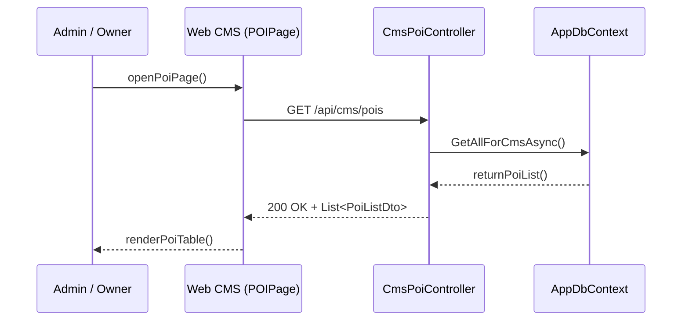
```mermaid
sequenceDiagram
    participant User as Admin / Owner
    participant CMS as Web CMS (POIPage)
    participant PoiCtrl as CmsPoiController
    participant DB as AppDbContext

    User ->> CMS: openPoiPage()
    CMS ->> PoiCtrl: GET /api/cms/pois
    PoiCtrl ->> DB: GetAllForCmsAsync()
    DB -->> PoiCtrl: returnPoiList()
    PoiCtrl -->> CMS: 200 OK + List<PoiListDto>
    CMS -->> User: renderPoiTable()
```

---

### 10.21c. CMS — Owner Gửi Yêu Cầu Cập Nhật POI (🌐 Web CMS — UC23, UC31)

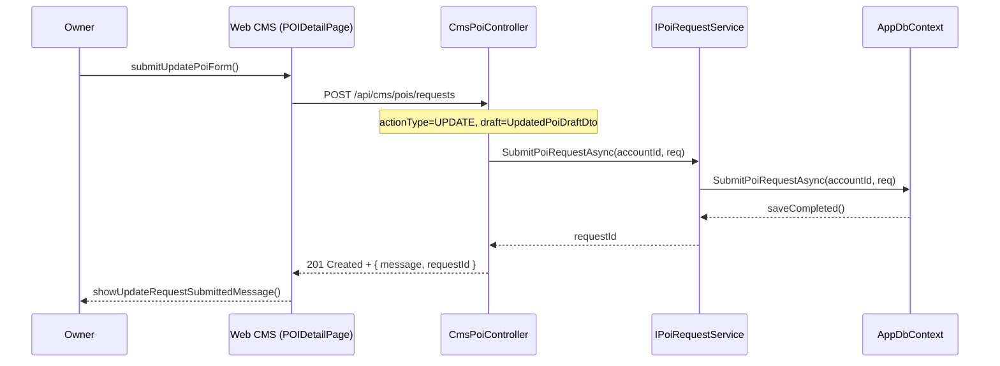
```mermaid
sequenceDiagram
    participant Owner
    participant CMS as Web CMS (POIDetailPage)
    participant PoiCtrl as CmsPoiController
    participant SvcReq as IPoiRequestService
    participant DB as AppDbContext

    Owner ->> CMS: submitUpdatePoiForm()
    CMS ->> PoiCtrl: POST /api/cms/pois/requests
    Note over PoiCtrl: actionType=UPDATE, draft=UpdatedPoiDraftDto
    PoiCtrl ->> SvcReq: SubmitPoiRequestAsync(accountId, req)
    SvcReq ->> DB: SubmitPoiRequestAsync(accountId, req)
    DB -->> SvcReq: saveCompleted()
    SvcReq -->> PoiCtrl: requestId
    PoiCtrl -->> CMS: 201 Created + { message, requestId }
    CMS -->> Owner: showUpdateRequestSubmittedMessage()
```

---

### 10.21c. CMS — Owner Gửi Yêu Cầu Xóa POI (🌐 Web CMS — UC23, UC31)

```mermaid
sequenceDiagram
    participant Owner
    participant CMS as Web CMS (POIPage)
    participant PoiCtrl as CmsPoiController
    participant SvcReq as IPoiRequestService
    participant DB as AppDbContext

    Owner ->> CMS: selectPoiAndClickDelete()
    CMS -->> Owner: showDeleteConfirmationDialog()
    Owner ->> CMS: confirmDeleteRequest()
    
    CMS ->> PoiCtrl: POST /api/cms/pois/requests
    Note over PoiCtrl: actionType=DELETE, draft=null
    PoiCtrl ->> SvcReq: SubmitPoiRequestAsync(accountId, req)
    SvcReq ->> DB: SubmitPoiRequestAsync(accountId, req)
    DB -->> SvcReq: saveCompleted(accountId, req)
    
    SvcReq -->> PoiCtrl: requestId
    PoiCtrl -->> CMS: 201 Created + { message, requestId }
    CMS -->> Owner: showDeleteRequestSubmittedMessage()
```

---

### 10.22a. CMS — Owner Gửi Yêu Cầu TẠO POI (🌐 Web CMS — UC22)


```mermaid
sequenceDiagram
    participant Owner
    participant CMS as Web CMS (AddPOIPage)
    participant PoiCtrl as CmsPoiController
    participant SvcReq as IPoiRequestService
    participant DB as AppDbContext

    Owner ->> CMS: submitPoiRequestForm()
    CMS ->> PoiCtrl: POST /api/cms/pois/requests
    Note over PoiCtrl: actionType=CREATE, draft=PoiDraftDto
    PoiCtrl ->> SvcReq: SubmitPoiRequestAsync(accountId, req)
    SvcReq ->> DB: SubmitPoiRequestAsync()
    DB -->> SvcReq: saveCompleted()
    SvcReq -->> PoiCtrl: requestId
    PoiCtrl -->> CMS: 200 OK + { message, requestId }
    CMS -->> Owner: showRequestSubmittedMessage()
```

---

### 10.22b. CMS — Admin Duyệt/Từ Chối POI Request (🌐 Web CMS — UC33/UC34/UC35b)

```mermaid
sequenceDiagram
    participant Admin
    participant CMS as Web CMS (POIManagementPage)
    participant PoiCtrl as CmsPoiController
    participant SvcReq as IPoiRequestService
    participant DB as AppDbContext

    Admin ->> CMS: openPoiRequestReviewTab()
    CMS ->> PoiCtrl: GET /api/cms/pois/requests
    PoiCtrl -->> CMS: 200 OK + List<PoiRequestListDto>
    CMS -->> Admin: renderRequestTable()

    Admin ->> CMS: openRequestDetail()
    CMS ->> PoiCtrl: GET /api/cms/pois/requests/{requestId}
    PoiCtrl -->> CMS: 200 OK + request detail

    alt APPROVED
        Admin ->> CMS: approveRequest()
        CMS ->> PoiCtrl: PUT /api/cms/pois/requests/{requestId}/review (APPROVED)
        PoiCtrl ->> SvcReq: ReviewPoiRequestAsync(requestId, APPROVED)
        SvcReq ->> DB: ReviewPoiRequestAsync()
        DB -->> SvcReq: saveCompleted()
        SvcReq -->> PoiCtrl: returnReviewSuccess()
        PoiCtrl -->> CMS: 200 OK
        CMS -->> Admin: showApproveSuccessMessage()
    else REJECTED
        Admin ->> CMS: rejectRequestWithReason()
        CMS ->> PoiCtrl: PUT /api/cms/pois/requests/{requestId}/review (REJECTED)
        PoiCtrl ->> SvcReq: ReviewPoiRequestAsync(requestId, REJECTED)
        SvcReq ->> DB: ReviewPoiRequestAsync()
        DB -->> SvcReq: saveCompleted()
        PoiCtrl -->> CMS: 200 OK
        CMS -->> Admin: showRejectSuccessMessage()
    end
```

---

### 10.24a. CMS — Owner Xem Gói Subscription (🌐 Web CMS — UC25)

```mermaid
sequenceDiagram
    participant Owner
    participant CMS as Web CMS (PricingPlansPage)
    participant SubCtrl as CmsSubscriptionController
    participant SubSvc as SubscriptionService
    participant DB as AppDbContext

    Owner ->> CMS: openPricingPlansPage()
    CMS ->> SubCtrl: GET /api/cms/subscriptions/plans
    SubCtrl ->> DB: GetPlans()
    DB -->> SubCtrl: List<SubscriptionPlan>
    SubCtrl -->> CMS: 200 OK + plans[]
    
    CMS ->> SubCtrl: GET /api/cms/subscriptions/me
    SubCtrl ->> SubSvc: GetActiveSubscriptionAsync(accountId)
    SubSvc ->> DB: GetActiveSubscriptionAsync(accountId)
    DB -->> SubSvc: OwnerSubscription (or null)
    SubSvc -->> SubCtrl: OwnerSubscription
    SubCtrl ->> SubSvc: GetCurrentPlanAsync(accountId)
    SubSvc ->> DB: Accounts.Include().FirstOrDefaultAsync()
    DB -->> SubSvc: SubscriptionPlan (or fallback basic)
    SubSvc -->> SubCtrl: SubscriptionPlan
    SubCtrl -->> CMS: 200 OK + { currentPlan, activeSubscription }
    CMS -->> Owner: renderPlanComparison()
```

---

### 10.24b. CMS — Owner Nâng Gói (Subscription Upgrade) (🌐 Web CMS — UC29)

```mermaid
sequenceDiagram
    participant Owner
    participant CMS as Web CMS (SubscriptionCheckoutPage)
    participant SubCtrl as CmsSubscriptionController
    participant DB as AppDbContext
    participant Webhook as SePay/MoMo Webhook
    participant SePayCtrl as SePayWebhookController

    Owner ->> CMS: submitUpgradePlanRequest()
    CMS ->> SubCtrl: POST /api/cms/subscriptions/upgrade/init
    SubCtrl ->> DB: InitUpgrade()
    SubCtrl -->> CMS: 200 OK + { transactionId, vietQrUrl, transferContent }
    CMS -->> Owner: renderUpgradePaymentQr()

    loop Owner poll verify (mỗi 5 giây)
        CMS ->> SubCtrl: GET /api/cms/subscriptions/upgrade/verify?transactionId=...
        alt Thanh toán hoàn tất (Webhook đã xử lý)
            SubCtrl -->> CMS: 200 OK + { status=SUCCESS }
            CMS -->> Owner: showUpgradeSuccessMessage()
        else Đang chờ
            SubCtrl -->> CMS: 200 OK + { status=PENDING }
            CMS ->> CMS: continuePolling()
        end
    end

    Note over Webhook,SePayCtrl: Song song — Webhook tự động kích hoạt khi nhận thanh toán
    Webhook ->> SePayCtrl: POST /api/payment/sepay/webhook
    SePayCtrl ->> DB: HandleSePayAsync()
    SePayCtrl ->> DB: ActivateSubscriptionAsync()
```

---


### 10.25b. CMS — Dịch & TTS Sang Ngôn Ngữ Mới (🌐 Web CMS — UC37)

```mermaid
sequenceDiagram
    participant Admin
    participant CMS as Web CMS
    participant PipeCtrl as CmsContentPipelineController
    participant Pipeline as ContentPipelineService
    participant Trans as TranslationService
    participant TTS as TtsService
    participant Blob as BlobStorageService
    participant DB as AppDbContext

    Admin ->> CMS: triggerGenerateTranslation()
    CMS ->> PipeCtrl: POST /api/cms/pipeline/generate/{poiId}
    PipeCtrl ->> Pipeline: EnsureContentAsync(poi, lang)
    Pipeline ->> DB: EnsureContentAsync()

    alt Chưa có bản dịch
        Pipeline ->> Trans: TranslateAsync(title, masterLang, lang)
        Trans -->> Pipeline: returnTranslatedTitle()
        Pipeline ->> Trans: TranslateAsync(desc, masterLang, lang)
        Trans -->> Pipeline: returnTranslatedDescription()
        Pipeline ->> TTS: SynthesizeAsync(translatedText, lang)
        TTS -->> Pipeline: returnAudioStream()
        Pipeline ->> Blob: UploadAsync(stream)
        Blob -->> Pipeline: returnAudioUrl()
        Pipeline ->> DB: EnsureContentAsync()
        Pipeline -->> PipeCtrl: returnNewPoiContent()
    else Đã có
        DB -->> Pipeline: returnExistingPoiContent()
        Pipeline -->> PipeCtrl: returnExistingContent()
    end

    PipeCtrl -->> CMS: 200 OK
    CMS -->> Admin: renderTranslatedContent()
```

---

### 10.26a. CMS — Gallery & Media Upload (🌐 Web CMS — UC24)

```mermaid
sequenceDiagram
    participant Admin
    participant CMS as Web CMS (POIDetailPage)
    participant MediaCtrl as MediaController
    participant GalleryCtrl as CmsPoiGalleryController
    participant Blob as BlobStorageService
    participant DB as AppDbContext

    Admin ->> CMS: selectGalleryImage()
    CMS ->> MediaCtrl: POST /api/cms/upload/image (file + folder="pois")
    MediaCtrl ->> Blob: UploadAsync("images", path, file)
    Blob -->> MediaCtrl: fileUrl
    MediaCtrl -->> CMS: 200 OK + { url, fileName, size }

    Admin ->> CMS: confirmGalleryImage()
    CMS ->> GalleryCtrl: POST /api/cms/pois/{poiId}/gallery
    Note over CMS,GalleryCtrl: { imageUrl: url, sortOrder: index }
    GalleryCtrl ->> DB: Create(poiId, req)
    DB -->> GalleryCtrl: saveCompleted()
    GalleryCtrl -->> CMS: 201 Created + { imageId, imageUrl, sortOrder }
    CMS -->> Admin: renderUpdatedGallery()

    Admin ->> CMS: deletePoiGalleryImage()
    CMS ->> GalleryCtrl: DELETE /api/cms/pois/{poiId}/gallery/{imageId}
    GalleryCtrl ->> DB: FirstOrDefaultAsync(imageId && poiId)
    DB -->> GalleryCtrl: PoiGallery
    GalleryCtrl ->> DB: Remove(image)
    DB -->> GalleryCtrl: saveCompleted()
    GalleryCtrl -->> CMS: 204 No Content
    CMS -->> Admin: renderGalleryUpdated()

    Admin ->> CMS: uploadMediaFile(logo/thumbnail)
    CMS ->> MediaCtrl: POST /api/cms/upload/image (file + folder="media")
    MediaCtrl ->> Blob: UploadAsync("images", path, file)
    Blob -->> MediaCtrl: fileUrl
    MediaCtrl -->> CMS: 200 OK + { url }
    CMS -->> Admin: renderMediaUrl()
```

---

### 10.16. Xem map dẫn đường tour (📱 Mobile)


```mermaid
sequenceDiagram
    participant MobileUser as Người dùng
    participant ListUI as TourListPage
    participant ListVM as TourListViewModel
    participant DetailUI as TourDetailPage
    participant DetailVM as TourDetailViewModel
    participant SyncSvc as SyncService

    MobileUser ->> ListUI: openToursTab()
    ListUI ->> ListVM: LoadToursAsync()
    ListVM ->> SyncSvc: GetToursAsync(lang)
    SyncSvc -->> ListVM: List<TourSummaryDto>
    ListVM -->> ListUI: renderTourList()

    MobileUser ->> ListUI: selectTourItem()
    ListUI ->> DetailUI: Navigate(tourId)
    DetailUI ->> DetailVM: LoadAsync(tourId)
    DetailVM ->> SyncSvc: GetTourDetailAsync(tourId, lang)
    SyncSvc -->> DetailVM: TourDetailDto
    DetailVM -->> DetailUI: renderTourDetailAndStops()

    MobileUser ->> DetailUI: tapStartTourButton()
    DetailUI -->> MobileUser: navigateToMapWithTourStops()
```

### 10.17. CMS — Bulk Content Pipeline: GenerateAllLanguages (⚙️ Backend)

```mermaid
sequenceDiagram
    participant Admin
    participant CMS as Web CMS (Browser)
    participant PipeCtrl as CmsContentPipelineController
    participant DB as AppDbContext
    participant Pipeline as ContentPipelineService
    participant Trans as TranslationService
    participant TTS as TtsService
    participant Blob as BlobStorageService

    Admin ->> CMS: triggerGenerateAllLanguages()
    CMS ->> PipeCtrl: POST /api/cms/pipeline/generate-all-languages
    activate PipeCtrl

    PipeCtrl ->> DB: Pois.Include(Contents).Where(IsActive).ToListAsync()
    DB -->> PipeCtrl: List<Poi>

    alt Không có Active POI
        PipeCtrl -->> CMS: 200 OK + { message: "Không có active POI" }
    else Có Active POIs
        Note over PipeCtrl: targetLangs = [vi, en, ja, ko, zh-Hans, fr, th]

        loop Mỗi POI
            loop Mỗi ngôn ngữ (7 langs)
                PipeCtrl ->> Pipeline: EnsureContentAsync(poi, lang)
                activate Pipeline

                Pipeline ->> DB: EnsureContentAsync()

                alt Đã có content cho lang này
                    DB -->> Pipeline: existing PoiContent
                else Chưa có → Tạo mới
                    Pipeline ->> DB: EnsureContentAsync()
                    Pipeline ->> Trans: TranslateAsync(title, masterLang, lang)
                    Trans -->> Pipeline: translated title
                    Pipeline ->> Trans: TranslateAsync(desc, masterLang, lang)
                    Trans -->> Pipeline: translated description
                    Pipeline ->> TTS: SynthesizeAsync(translatedText, lang)
                    TTS -->> Pipeline: audio MP3 stream
                    Pipeline ->> Blob: UploadAsync("audio", path, stream)
                    Blob -->> Pipeline: audioUrl
                    Pipeline ->> DB: EnsureContentAsync()
                end

                Pipeline -->> PipeCtrl: PoiContent
                deactivate Pipeline

                opt Content thiếu AudioUrl
                    PipeCtrl ->> Pipeline: GenerateAudioAsync(content)
                    Pipeline ->> TTS: SynthesizeAsync(text, lang)
                    TTS -->> Pipeline: audio stream
                    Pipeline ->> Blob: UploadAsync(stream)
                    Blob -->> Pipeline: audioUrl
                    Pipeline ->> DB: GenerateAudioAsync()
                    Pipeline -->> PipeCtrl: updated PoiContent
                end
            end
        end

        PipeCtrl -->> CMS: 200 OK + { totalPois, successCount, failCount, results }
    end

    deactivate PipeCtrl
    CMS -->> Admin: renderPipelineResult()
```


### 10.18. CMS — Quản Lý Tài Khoản (🌐 Web CMS)

```mermaid
sequenceDiagram
    participant Admin
    participant CMS as Web CMS (AccountPage)
    participant AccCtrl as CmsAccountController
    participant Repo as IAccountRepository
    participant DB as AppDbContext

    Admin ->> CMS: openAccountPage()
    CMS ->> AccCtrl: GET /api/cms/accounts
    AccCtrl ->> Repo: GetAllAsync()
    Repo ->> DB: GetAllAsync()
    DB -->> Repo: returnAccountList()
    Repo -->> AccCtrl: returnAccountList()
    AccCtrl -->> CMS: 200 OK + List<AccountDto>
    CMS -->> Admin: renderAccountTable()

    Admin ->> CMS: submitCreateAccountForm()
    CMS ->> AccCtrl: POST /api/cms/accounts
    AccCtrl ->> Repo: ExistsByUsernameAsync(username)

    alt Username đã tồn tại
        Repo -->> AccCtrl: true
        AccCtrl -->> CMS: 400 "Username already exists"
        CMS -->> Admin: showDuplicateUsernameError()
    else Username hợp lệ
        AccCtrl ->> AccCtrl: BCrypt.HashPassword(password)
        AccCtrl ->> Repo: CreateAsync(account)
        Repo ->> DB: CreateAsync()
        Repo -->> AccCtrl: Account
        AccCtrl -->> CMS: 201 Created + AccountDto
        CMS -->> Admin: showAccountCreateSuccess()
    end

    Admin ->> CMS: submitUpdateAccountForm()
    CMS ->> AccCtrl: PUT /api/cms/accounts/{id}
    AccCtrl ->> Repo: GetByIdAsync(id)
    alt Không tìm thấy
        AccCtrl -->> CMS: 404 Not Found
    else Tìm thấy
        AccCtrl ->> Repo: UpdateAsync(existing)
        AccCtrl -->> CMS: 200 OK + UpdatedAccountDto
    end

    Admin ->> CMS: deleteAccount()
    CMS ->> AccCtrl: DELETE /api/cms/accounts/{id}
    AccCtrl ->> Repo: DeleteAsync(id) - set isLocked = true
    alt Thành công
        AccCtrl -->> CMS: 204 No Content
    else Không tìm thấy
        AccCtrl -->> CMS: 404 Not Found
    end
```

### 10.19. CMS — Quản Lý Danh Mục (🌐 Web CMS)

```mermaid
sequenceDiagram
    participant Admin
    participant CMS as Web CMS (CategoryPage)
    participant CatCtrl as CmsCategoryController
    participant Repo as ICategoryRepository
    participant DB as AppDbContext

    Admin ->> CMS: openCategoryPage()
    CMS ->> CatCtrl: GET /api/cms/categories
    CatCtrl ->> Repo: GetAllAsync()
    Repo -->> CatCtrl: returnCategoryList()
    CatCtrl -->> CMS: 200 OK + List<CategoryDto>
    CMS -->> Admin: renderCategoryTable()

    Admin ->> CMS: submitCreateCategory()
    CMS ->> CatCtrl: POST /api/cms/categories
    CatCtrl ->> Repo: CreateAsync(category)
    Repo ->> DB: CreateAsync()
    CatCtrl -->> CMS: 201 Created + CategoryDto
    CMS -->> Admin: renderCreatedCategory()

    Admin ->> CMS: submitRenameCategory()
    CMS ->> CatCtrl: PUT /api/cms/categories/{id}
    CatCtrl ->> Repo: GetByIdAsync(id)
    CatCtrl ->> Repo: UpdateAsync(existing)
    CatCtrl -->> CMS: 200 OK + UpdatedCategoryDto

    Admin ->> CMS: assignPoiToCategory()
    CMS ->> CatCtrl: POST /api/cms/categories/{id}/pois
    CatCtrl ->> Repo: AddPoiAsync(catId, poiId)
    Repo ->> DB: AddPoiAsync()
    CatCtrl -->> CMS: 204 No Content
    CMS -->> Admin: showPoiAssignedSuccess()

    Admin ->> CMS: removePoiFromCategory()
    CMS ->> CatCtrl: DELETE /api/cms/categories/{id}/pois/{poiId}
    CatCtrl ->> Repo: RemovePoiAsync(catId, poiId)
    Repo ->> DB: RemovePoiAsync()
    CatCtrl -->> CMS: 204 No Content

    Admin ->> CMS: deleteCategory()
    CMS ->> CatCtrl: DELETE /api/cms/categories/{id}
    CatCtrl ->> Repo: DeleteAsync(id)
    CatCtrl -->> CMS: 204 No Content
```

### 10.20. CMS — Quản Lý Tour (🌐 Web CMS — UC41)

```mermaid
sequenceDiagram
    participant Admin
    participant CMS as Web CMS (ToursPage / CreateTourPage)
    participant TourCtrl as CmsTourController
    participant Repo as ITourRepository
    participant Trans as ITranslationService
    participant DB as AppDbContext

    Admin ->> CMS: openTourPage()
    CMS ->> TourCtrl: GET /api/cms/tours
    TourCtrl ->> Repo: GetAllAsync()
    Repo -->> TourCtrl: returnTourList()
    TourCtrl -->> CMS: 200 OK + List<TourDto>
    CMS -->> Admin: renderTourTable()

    Admin ->> CMS: submitCreateTourForm()
    CMS ->> TourCtrl: POST /api/cms/tours
    TourCtrl ->> Trans: TranslateToAllLanguagesAsync(name, "vi")
    Trans -->> TourCtrl: nameDict (7 langs JSON)
    TourCtrl ->> Repo: CreateAsync(tour with LocalizedName)
    Repo ->> DB: CreateAsync()
    TourCtrl -->> CMS: 201 Created + TourDto
    CMS -->> Admin: renderCreatedTour()

    Admin ->> CMS: addPoiToTour()
    CMS ->> TourCtrl: POST /api/cms/tours/{id}/pois
    TourCtrl ->> Repo: AddPoiAsync(tourId, poiId, stepOrder)
    Repo ->> DB: AddPoiAsync()
    TourCtrl -->> CMS: 204 No Content

    Admin ->> CMS: reorderTourStep()
    CMS ->> TourCtrl: PUT /api/cms/tours/{id}/pois/{poiId}/order
    TourCtrl ->> Repo: ReorderPoiAsync(tourId, poiId, newOrder)
    Repo ->> DB: ReorderPoiAsync()
    TourCtrl -->> CMS: 204 No Content

    Admin ->> CMS: removePoiFromTour()
    CMS ->> TourCtrl: DELETE /api/cms/tours/{id}/pois/{poiId}
    TourCtrl ->> Repo: RemovePoiAsync(tourId, poiId)
    Repo ->> DB: RemovePoiAsync()
    TourCtrl -->> CMS: 204 No Content

    alt Soft-delete tour
        Admin ->> CMS: softDeleteTour()
        CMS ->> TourCtrl: DELETE /api/cms/tours/{id}
        TourCtrl ->> Repo: DeleteAsync(id) — set IsActive=false
        TourCtrl -->> CMS: 204 No Content
    else Restore tour
        Admin ->> CMS: restoreTour()
        CMS ->> TourCtrl: PATCH /api/cms/tours/{id}/restore
        TourCtrl ->> Repo: RestoreAsync(id) — set IsActive=true
        TourCtrl -->> CMS: 204 No Content
    end
```


### 10.21. Real-Time Device Monitoring — SignalR (📱 Mobile ↔ 🌐 Web CMS)

```mermaid
sequenceDiagram
    participant Mobile as 📱 Mobile App
    participant Admin as 🛡️ Admin (CMS)
    participant Hub as DeviceHub (SignalR)
    participant Presence as DevicePresenceService
    participant Queue as ILocationQueue
    participant DB as AppDbContext

    Note over Mobile,Hub: Mobile kết nối với JWT GuestApp
    Mobile ->> Hub: Connect (JWT GuestApp)
    Hub ->> Presence: MarkOnline(connectionId, deviceId)
    Hub ->> Admin: broadcastDeviceOnline()

    Note over Admin,Hub: Admin kết nối với JWT Admin
    Admin ->> Hub: Connect (JWT Admin)
    Hub ->> Presence: MarkOnline(connectionId, "")
    Hub ->> Hub: AddToGroup("admin_dashboard")

    Admin ->> Hub: GetActiveDevices()
    Hub ->> Presence: GetOnlineDeviceIds()
    Hub -->> Admin: returnActiveDeviceSnapshot()

    loop Định kỳ GPS polling
        Mobile ->> Hub: SendLocationUpdate(lat, lon)
        Hub ->> Queue: QueueLocationAsync(LocationLog)
        Hub ->> Admin: broadcastLocationUpdated()
    end

    Mobile ->> Hub: Disconnect
    Hub ->> Presence: MarkOffline(connectionId) → deviceId
    Hub ->> Admin: broadcastDeviceOffline()
```

### 10.22. CMS — Quản Lý Access Code (🌐 Web CMS)

```mermaid
sequenceDiagram
    participant Admin
    participant CMS as Web CMS (AccessCodePage)
    participant CodeCtrl as CmsAccessCodeController
    participant DB as AppDbContext

    Admin ->> CMS: openAccessCodePage()
    CMS ->> CodeCtrl: GET /api/cms/accesscodes
    CodeCtrl ->> DB: GetAccessCodes()
    DB -->> CodeCtrl: List<AppAccessCode> + pagination
    CodeCtrl -->> CMS: 200 OK + { data, pagination }
    CMS -->> Admin: renderAccessCodeTable()

    Admin ->> CMS: submitCreateAccessCodeBatch()
    CMS ->> CodeCtrl: POST /api/cms/accesscodes
    CodeCtrl ->> CodeCtrl: GenerateRandomCode()
    CodeCtrl ->> DB: CreateCodes()
    CodeCtrl -->> CMS: 200 OK + { message, codes[] }
    CMS -->> Admin: renderNewAccessCodes()

    Admin ->> CMS: deleteAccessCode()
    CMS ->> CodeCtrl: DELETE /api/cms/accesscodes/{id}
    CodeCtrl ->> DB: DeleteCode()
    CodeCtrl -->> CMS: 200 OK + { message }
```

### 10.23. CMS — Xem Timeline Hoạt Động Thiết Bị (🌐 Web CMS)

```mermaid
sequenceDiagram
    participant Admin
    participant CMS as DeviceActivityPage (CMS)
    participant AnalCtrl as AnalyticsController
    participant DB as AppDbContext

    Admin ->> CMS: submitDeviceActivityFilter()
    CMS ->> AnalCtrl: GET /api/cms/analytics/device-activity
    AnalCtrl ->> DB: GetDeviceActivity()
    AnalCtrl ->> DB: GetDeviceActivity()
    DB -->> AnalCtrl: ListenHistory[] + LocationLog[]
    AnalCtrl ->> AnalCtrl: Merge & sort by Timestamp → timeline[]
    AnalCtrl -->> CMS: 200 OK + DeviceActivityDto
    CMS -->> Admin: renderDeviceActivityTimeline()
```

---

### 10.24. CMS — Gán Gói Subscription Thủ Công (🌐 Web CMS — UC45)


```mermaid
sequenceDiagram
    participant Admin
    participant SubPage as SubscriptionPage (B)
    participant SubCtrl as CmsSubscriptionController
    participant SubSvc as SubscriptionService
    participant DB as AppDbContext

    Admin ->> SubPage: Chọn Owner + chọn Plan mới
    SubPage ->> SubCtrl: POST /api/cms/subscriptions/owner/{accountId}/assign\n{ planId, gateway }
    SubCtrl ->> DB: Accounts.FindAsync(accountId)
    SubCtrl ->> DB: SubscriptionPlans.FindAsync(planId)
    SubCtrl ->> DB: PaymentTransactions.Add(tx) + SaveChangesAsync()
    SubCtrl ->> SubSvc: ActivateSubscriptionAsync(accountId, planId, transactionId)
    SubSvc -->> SubCtrl: OwnerSubscription
    SubCtrl ->> DB: SaveChangesAsync() (gắn SubscriptionId vào tx)
    SubCtrl -->> SubPage: 200 OK + { message, subscriptionId, transactionId, endDate }
    SubPage -->> Admin: Toast "Gán gói thành công"
```

---

### 10.25. CMS — Xem Lịch Sử Giao Dịch (🌐 Web CMS — UC46)


```mermaid
sequenceDiagram
    participant Admin
    participant TxPage as TransactionPage (B)
    participant PayCtrl as CmsPaymentController
    participant DB as AppDbContext

    Admin ->> TxPage: Mở trang Giao dịch (filter: paymentType, status, gateway, accountId, page)
    TxPage ->> PayCtrl: GET /api/cms/payments?paymentType=&status=&gateway=&accountId=&page=&pageSize=
    PayCtrl ->> DB: CountAsync() on filtered PaymentTransactions query
    PayCtrl ->> DB: ToListAsync() after OrderByDescending(CreatedAt), Skip, Take, Select projection
    DB -->> PayCtrl: total + rows
    PayCtrl -->> TxPage: 200 { data, pagination }
    TxPage -->> Admin: Render bảng giao dịch

    opt Xem chi tiết
        Admin ->> TxPage: Click vào 1 giao dịch
        TxPage ->> PayCtrl: GET /api/cms/payments/{transactionId}
        PayCtrl ->> DB: FirstOrDefaultAsync(PaymentTransactions by id, Include Account, Plan, Subscription)
        DB -->> PayCtrl: PaymentTransaction + navigations
        PayCtrl -->> TxPage: 200 detail DTO
        TxPage -->> Admin: Hiển thị modal chi tiết
    end

    note over PayCtrl,DB: PaymentCleanupService (HostedService) đánh dấu PENDING quá hạn → EXPIRED\ntheo cấu hình PaymentCleanup (mặc định ~30 phút)
```

---

### 10.26. CMS — Giả Lập Geofence Conflict (🌐 Web CMS — UC60)


```mermaid
sequenceDiagram
    participant Admin
    participant SimPage as GeofenceSimulatorPage (B)
    participant API as GeofenceSimulatorController (C)
    participant DB as AppDbContext

    Admin ->> SimPage: Cấu hình kịch bản\n(lat/lng, customPois hoặc DB)
    SimPage ->> API: POST /api/cms/debug/geofence-simulate
    alt CustomPois (simulator mode)
        Note over API: Dùng body CustomPois — không query DB
    else DB mode
        API ->> DB: Pois.Where(IsActive).Include(Contents).ToListAsync()
        DB -->> API: active POIs
    end

    API ->> API: Haversine filter trong ActivationRadius
    API ->> API: Lọc cooldown (theo CooldownOverrides)
    Note over API: Bước sort giống GeofenceService mobile: OrderByDescending(Priority), ThenByDescending(HasLocalAudio), ThenBy(Distance)
    API ->> API: Xác định decisionTier (Tier1_Priority / Tier2_HasLocalAudio / Tier3_Distance / Trivial_OnlyOne)

    API -->> SimPage: 200 SimulateResponse (winner, candidates, sortingTrace)
    SimPage -->> Admin: Render map + winner + trace
```

---

### 10.27. CMS — Giả Lập GPS Queue (🌐 Web CMS — UC59)


```mermaid
sequenceDiagram
    participant Admin
    participant Demo as QueueDemoPage (B)
    participant API as LocationLogController (C)
    participant Queue as ILocationQueue (C)
    participant Worker as LocationQueueHostedService (C)
    participant Repo as ILocationLogRepository

    Admin ->> Demo: Nhập Device ID + số lần gửi + interval
    
    loop N lần (configurable)
        Demo ->> API: POST /api/mobile/location-log\n{ deviceId, points: [{ latitude, longitude, timestamp }] }
        API ->> Queue: QueueLocationAsync(locationLog)
        Queue -->> API: queued
        API -->> Demo: 202 Accepted (không block)
    end

    note over Worker: Worker drain queue: batch ≤1000 items hoặc timeout 5 giây
    Worker ->> Queue: ReadAsync() (tích lũy batch)
    Worker ->> Repo: CreateBatchAsync(batch)
    Repo -->> Worker: completed

    Demo -->> Admin: Hiển thị throughput stats\n(sent / queued / flushed)
```

---

### 10.28. ListenHistory Queue — Luồng Ghi Lịch Sử Nghe (⚙️ Backend)


```mermaid
sequenceDiagram
    participant Mobile as Mobile (ApiService)
    participant ListenCtrl as ListenHistoryController
    participant ListenQ as IListenHistoryQueue
    participant Worker as ListenHistoryHostedService
    participant Repo as IListenHistoryRepository

    Note over Mobile,ListenCtrl: PostListenHistoryAsync sau khi phát audio kết thúc (PlaybackEnded)
    Mobile ->> ListenCtrl: POST /api/mobile/listen-history\n{ deviceId, poiId, listenDuration }
    ListenCtrl ->> ListenQ: QueueListenHistoryAsync(entry)
    ListenCtrl -->> Mobile: 202 Accepted

    loop ListenHistoryHostedService (batch ≤20, timeout 5s)
        Worker ->> ListenQ: ReadAsync()
        ListenQ -->> Worker: ListenHistory item(s)
        Worker ->> Repo: CreateBatchAsync(batch)
        Repo -->> Worker: completed
        Worker ->> Worker: batch.Clear()
    end
```

---

### 10.29. RabbitMQ Location Queue — Tương tác tóm tắt (⚙️ Backend)


```mermaid
sequenceDiagram
    participant API as LocationLogController
    participant LocQ as RabbitMQLocationQueue\n(ILocationQueue)
    participant RMQ as RabbitMQ Broker
    participant Worker as LocationQueueHostedService
    participant Repo as ILocationLogRepository

    API ->> LocQ: QueueLocationAsync(locationLog)
    LocQ -->> API: Đã enqueue (HTTP trả 202 Accepted)

    Note over LocQ,RMQ: Publish (RabbitMQ.Client) → queue `location_logs`
    LocQ ->> RMQ: Message (GPS log)

    Note over RMQ,LocQ: Consumer (thư viện) nhận từ broker → LocQ phục vụ ReadAsync
    RMQ -->> LocQ: Delivered messages

    loop Batch ≤1000 hoặc timeout 5s
        Worker ->> LocQ: ReadAsync()
        LocQ -->> Worker: LocationLog
        Worker ->> Repo: CreateBatchAsync(batch)
        Repo -->> Worker: completed
    end
```

---

## 📋 11. SƠ ĐỒ HOẠT ĐỘNG (ACTIVITY DIAGRAMS)

> **Quy ước ký hiệu:** `((●))` = Start (filled circle) · `((◉))` = End · `{ }` = Decision (diamond) · `[ ]` = Action (rectangle)

### 11.1. Luồng Khởi Động App & Quyết Định Màn Hình (📱 Mobile - UC1, UC2, UC3)

```mermaid
flowchart TD
    START(( ● )) --> CHECK_TOKEN{Kiểm tra Token<br/>trong SecureStorage}
    
    CHECK_TOKEN -- Không có --> WELCOME[Hiển thị WelcomePage]
    CHECK_TOKEN -- Có token --> VALIDATE{Token còn hạn?}
    
    VALIDATE -- Hết hạn --> WELCOME
    VALIDATE -- Còn hạn --> MAIN[Chuyển sang MainPage]
    
    WELCOME --> QR_OPTION{Người dùng chọn}
    QR_OPTION -- Quét QR --> QR_SCAN[WelcomeQrScanPage]
    QR_OPTION -- Bỏ qua --> MAIN

    QR_SCAN --> SCAN_RESULT{Kết quả quét}
    SCAN_RESULT -- Thành công --> SAVE_TOKEN[Lưu token<br/>SecureStorage]
    SAVE_TOKEN --> MAIN
    SCAN_RESULT -- Thất bại --> QR_SCAN

    MAIN --> INIT[MainViewModel.InitAsync]
    INIT --> SYNC[SyncService<br/>GetPoisAsync]
    SYNC --> START_GPS[LocationService<br/>StartAsync]
    START_GPS --> START_GEO[GeofenceService<br/>StartMonitoringAsync]
    START_GEO --> END_NODE(( ◉ ))

    style START fill:#000,color:#fff,stroke:#000
    style END_NODE fill:#000,color:#fff,stroke:#fff,stroke-width:3px
    style WELCOME fill:#FF9800,color:#fff
    style QR_SCAN fill:#FF9800,color:#fff
    style MAIN fill:#2196F3,color:#fff
```

### 11.2. Luồng Xử Lý Geofence — Kích Hoạt POI Tự Động (📱 Mobile - UC4, UC5, UC6)

```mermaid
flowchart TD
    START(( ● )) --> CALC[Tính khoảng cách Haversine<br/>đến tất cả POI đang monitor]
    
    CALC --> FILTER{POI nào trong<br/>ActivationRadius?}
    
    FILTER -- Không có POI --> END_WAIT(( ◉ ))
    FILTER -- Có POI --> CHECK_ACTIVE{POI.IsActive == true?}
    
    CHECK_ACTIVE -- false --> FILTER
    CHECK_ACTIVE -- true --> CHECK_COOLDOWN{Cooldown<br/>đã hết?}
    
    CHECK_COOLDOWN -- Chưa hết --> END_WAIT
    CHECK_COOLDOWN -- Hết rồi --> SORT[Sắp xếp:<br/>1. Priority ↓<br/>2. Distance ↑]
    
    SORT --> SELECT[Chọn POI tốt nhất<br/>= phần tử đầu tiên]
    
    SELECT --> TRIGGER[PoiTriggered event]
    
    TRIGGER --> AUDIO_CHECK{Audio đang phát?}
    
    AUDIO_CHECK -- Đang phát POI cũ --> STOP_OLD[StopAsync - dừng cũ]
    STOP_OLD --> LOG_HISTORY[Ghi nhận lịch sử<br/>QueueListenHistoryAsync]
    LOG_HISTORY --> PLAY_NEW
    AUDIO_CHECK -- Không phát --> PLAY_NEW
    
    PLAY_NEW[TriggerAudioAsync] --> FALLBACK{Nguồn audio?}
    
    FALLBACK -- LocalAudioPath exists --> PLAY_LOCAL[PlayFileAsync - local]
    FALLBACK -- AudioUrl available --> PLAY_URL[PlayFileAsync - URL]
    FALLBACK -- Chỉ có text --> PLAY_TTS[SpeakAsync - TTS]
    
    PLAY_LOCAL --> UPDATE_UI[Cập nhật MiniPlayer]
    PLAY_URL --> UPDATE_UI
    PLAY_TTS --> UPDATE_UI
    UPDATE_UI --> SET_COOLDOWN[Đặt cooldown cho POI này]
    SET_COOLDOWN --> END_WAIT

    style START fill:#000,color:#fff,stroke:#000
    style END_WAIT fill:#000,color:#fff,stroke:#fff,stroke-width:3px
    style TRIGGER fill:#F44336,color:#fff
    style PLAY_NEW fill:#2196F3,color:#fff
```

### 11.3. Luồng Content Pipeline (⚙️ Backend - UC35, UC36, UC37, UC38)

```mermaid
flowchart TD
    START(( ● )) --> LOCK[Acquire SemaphoreSlim]
    
    LOCK --> CHECK_EXISTING{Đã có PoiContent<br/>cho ngôn ngữ này?}
    
    CHECK_EXISTING -- Có --> RETURN_EXISTING[Trả về content hiện tại]
    RETURN_EXISTING --> RELEASE[Release Semaphore]
    
    CHECK_EXISTING -- Chưa có --> GET_MASTER[Lấy Master Content<br/>IsMaster = true]
    
    GET_MASTER --> MASTER_EXISTS{Master tồn tại?}
    
    MASTER_EXISTS -- Không --> ERROR[Throw Exception]
    ERROR --> RELEASE
    
    MASTER_EXISTS -- Có --> TRANSLATE_TITLE[Azure Translator:<br/>Dịch Title]
    TRANSLATE_TITLE --> TRANSLATE_DESC[Azure Translator:<br/>Dịch Description]
    TRANSLATE_DESC --> TTS_GEN[Azure TTS:<br/>Sinh audio MP3]
    TTS_GEN --> UPLOAD_BLOB[Azure Blob:<br/>Upload MP3 file]
    UPLOAD_BLOB --> SAVE_DB[Lưu PoiContent mới<br/>vào Database]
    SAVE_DB --> RETURN_NEW[Trả về content mới]
    RETURN_NEW --> RELEASE
    
    RELEASE --> END_NODE(( ◉ ))

    style START fill:#000,color:#fff,stroke:#000
    style END_NODE fill:#000,color:#fff,stroke:#fff,stroke-width:3px
    style ERROR fill:#F44336,color:#fff
```

### 11.4. Luồng Đồng Bộ Offline-First (📱 Mobile - UC2)

```mermaid
flowchart TD
    START(( ● )) --> TRY_API{Gọi API<br/>thành công?}
    
    TRY_API -- Thành công --> SAVE_CACHE[Lưu vào SQLite Cache]
    SAVE_CACHE --> BG_DOWNLOAD

    TRY_API -- Thất bại offline --> LOAD_CACHE[Đọc từ SQLite Cache]
    LOAD_CACHE --> RETURN[Trả về List POI]

    BG_DOWNLOAD[Background Download] --> DL_AUDIO[Tải audio .mp3<br/>→ local storage]
    DL_AUDIO --> DL_IMAGE[Tải logo/ảnh<br/>→ local storage]
    DL_IMAGE --> UPDATE_LOCAL[Cập nhật LocalAudioPath<br/>LocalLogoPath trong SQLite]
    UPDATE_LOCAL --> RETURN

    RETURN --> END_NODE(( ◉ ))

    style START fill:#000,color:#fff,stroke:#000
    style END_NODE fill:#000,color:#fff,stroke:#fff,stroke-width:3px
    style BG_DOWNLOAD fill:#FF9800,color:#fff
```

### 11.5. Xác Thực QR Code (📱 Mobile - UC2)

```mermaid
flowchart TD
    START(( ● )) --> DECODE[Giải mã QR → code string]
    DECODE --> SEND[POST /api/mobile/auth/scan-qr<br/>body: code + deviceId]
    
    SEND --> LOOKUP{Backend tìm<br/>AppAccessCode?}
    
    LOOKUP -- Không tìm thấy --> ERR_404[❌ Mã không hợp lệ]
    ERR_404 --> SHOW_ERR[Hiển thị lỗi cho user]
    
    LOOKUP -- Tìm thấy --> CHECK_DEVICE{UsedByDeviceId?}
    
    CHECK_DEVICE -- Đã dùng bởi<br/>device khác --> ERR_403[❌ Mã đã kích hoạt<br/>cho thiết bị khác]
    ERR_403 --> SHOW_ERR
    
    CHECK_DEVICE -- null hoặc<br/>cùng device --> CHECK_EXPIRE{ExpireAt nhỏ hơn now?}
    
    CHECK_EXPIRE -- Hết hạn --> ERR_410[❌ Mã đã hết hạn<br/>7 ngày]
    ERR_410 --> SHOW_ERR
    
    CHECK_EXPIRE -- Còn hạn<br/>hoặc lần đầu --> ACTIVATE[Kích hoạt mã:<br/>UsedByDeviceId = deviceId<br/>ActivatedAt = now<br/>ExpireAt = now + 7 days]
    
    ACTIVATE --> GEN_TOKEN[Sinh JWT token]
    GEN_TOKEN --> RETURN_OK[200 OK + token]
    RETURN_OK --> SAVE[Mobile lưu token<br/>vào SecureStorage]
    SAVE --> NAV[Chuyển sang MainPage]
    NAV --> END_SUCCESS(( ◉ ))
    
    SHOW_ERR --> RETRY{Thử lại?}
    RETRY -- Có --> DECODE
    RETRY -- Không --> END_FAIL(( ◉ ))

    style START fill:#000,color:#fff,stroke:#000
    style END_SUCCESS fill:#000,color:#fff,stroke:#fff,stroke-width:3px
    style END_FAIL fill:#000,color:#fff,stroke:#fff,stroke-width:3px
    style ERR_404 fill:#F44336,color:#fff
    style ERR_403 fill:#F44336,color:#fff
    style ERR_410 fill:#F44336,color:#fff
```

### 11.6. CMS — Quản Lý POI Activity (🌐 Web CMS - UC21-UC25)

```mermaid
flowchart TD
    START(( ● )) --> LOGIN{Admin đã<br/>đăng nhập?}
    
    LOGIN -- Chưa --> AUTH[Nhập username/password]
    AUTH --> VERIFY{Xác thực?}
    VERIFY -- Thất bại --> AUTH
    VERIFY -- Thành công --> SAVE_JWT[Lưu JWT token]
    SAVE_JWT --> DASHBOARD
    LOGIN -- Rồi --> DASHBOARD[Vào Dashboard CMS]
    
    DASHBOARD --> ACTION{Admin chọn<br/>hành động}
    
    ACTION -- Tạo POI --> CREATE_FORM[Điền form thông tin POI]
    CREATE_FORM --> VALIDATE_CREATE{Dữ liệu hợp lệ?}
    VALIDATE_CREATE -- Không --> CREATE_FORM
    VALIDATE_CREATE -- Có --> SAVE_POI[POST /api/cms/poi]
    SAVE_POI --> RESULT_CREATE{Thành công?}
    RESULT_CREATE -- Có --> DASHBOARD
    RESULT_CREATE -- Không --> SHOW_ERR[Hiển thị lỗi]
    SHOW_ERR --> DASHBOARD
    
    ACTION -- Sửa POI --> EDIT_FORM[Chỉnh sửa thông tin POI]
    EDIT_FORM --> SAVE_EDIT[PUT /api/cms/poi/id]
    SAVE_EDIT --> DASHBOARD
    
    ACTION -- Xóa POI --> CONFIRM{Xác nhận xóa?}
    CONFIRM -- Không --> DASHBOARD
    CONFIRM -- Có --> DELETE_POI[DELETE /api/cms/poi/id]
    DELETE_POI --> DASHBOARD
    
    ACTION -- Tạo Audio --> GEN_AUDIO[POST pipeline/generate/poiId]
    GEN_AUDIO --> DASHBOARD
    
    ACTION -- Dịch thuật --> GEN_TRANSLATE[POST pipeline/generate-all-languages]
    GEN_TRANSLATE --> DASHBOARD
    
    ACTION -- Đăng xuất --> END_NODE(( ◉ ))

    style START fill:#000,color:#fff,stroke:#000
    style END_NODE fill:#000,color:#fff,stroke:#fff,stroke-width:3px
    style DASHBOARD fill:#2196F3,color:#fff
    style SHOW_ERR fill:#F44336,color:#fff
```

### 11.7. CMS — Bulk Content Pipeline: GenerateAllLanguages (⚙️ Backend - UC38)

```mermaid
flowchart TD
    START((●)) --> CHECK_POIS[Query Active POIs from DB]
    CHECK_POIS --> HAS_POIS{Có Active POI?}

    HAS_POIS -- Không --> RETURN_EMPTY[Return: Không có active POI] --> END_EMPTY((◉))
    HAS_POIS -- Có --> INIT_LOOP[targetLangs = vi en ja ko zh-Hans fr th]

    INIT_LOOP --> LOOP_POI{Còn POI chưa xử lý?}
    LOOP_POI -- Không --> RETURN_RESULT[Return: totalPois, successCount, failCount] --> END_OK((◉))
    LOOP_POI -- Có --> NEXT_POI[Lấy POI tiếp theo]

    NEXT_POI --> LOOP_LANG{Còn lang chưa xử lý?}
    LOOP_LANG -- Không --> LOOP_POI
    LOOP_LANG -- Có --> NEXT_LANG[Lấy ngôn ngữ tiếp theo]

    NEXT_LANG --> ENSURE[EnsureContentAsync poi lang]
    ENSURE --> HAS_CONTENT{Đã có PoiContent?}

    HAS_CONTENT -- Có --> CHECK_AUDIO{Có AudioUrl?}
    HAS_CONTENT -- Không --> GET_MASTER[Lấy Master Content]
    GET_MASTER --> TRANSLATE_TITLE[TranslateAsync title]
    TRANSLATE_TITLE --> TRANSLATE_DESC[TranslateAsync description]
    TRANSLATE_DESC --> TTS_NEW[SynthesizeAsync text lang]
    TTS_NEW --> UPLOAD_NEW[UploadAsync to Blob Storage]
    UPLOAD_NEW --> SAVE_NEW[Add new PoiContent + SaveChanges]
    SAVE_NEW --> COUNT_SUCCESS_NEW[successCount++]
    COUNT_SUCCESS_NEW --> LOOP_LANG

    CHECK_AUDIO -- Có --> COUNT_SKIP[successCount++ skip TTS]
    COUNT_SKIP --> LOOP_LANG
    CHECK_AUDIO -- Không --> GEN_AUDIO[GenerateAudioAsync content]
    GEN_AUDIO --> TTS_EXIST[SynthesizeAsync text lang]
    TTS_EXIST --> UPLOAD_EXIST[UploadAsync to Blob]
    UPLOAD_EXIST --> UPDATE_URL[Update AudioUrl in DB]
    UPDATE_URL --> GEN_OK{Thành công?}
    GEN_OK -- Có --> COUNT_SUCCESS_GEN[successCount++]
    GEN_OK -- Không --> COUNT_FAIL[failCount++ + log error]
    COUNT_SUCCESS_GEN --> LOOP_LANG
    COUNT_FAIL --> LOOP_LANG

    style START fill:#000,color:#fff,stroke:#000
    style END_EMPTY fill:#000,color:#fff,stroke:#fff,stroke-width:3px
    style END_OK fill:#000,color:#fff,stroke:#fff,stroke-width:3px
    style RETURN_EMPTY fill:#FF9800,color:#fff
    style RETURN_RESULT fill:#4CAF50,color:#fff
    style COUNT_FAIL fill:#F44336,color:#fff
```

### 11.8. CMS — Quản Lý Tour Activity (🌐 Web CMS — UC41)

```mermaid
flowchart TD
    START((●)) --> LOGIN{Admin đã đăng nhập?}
    LOGIN -- Chưa --> AUTH[Đăng nhập CMS]
    AUTH --> LOGIN
    LOGIN -- Rồi --> VIEW_TOURS[GET /api/cms/tours]

    VIEW_TOURS --> HAS_TOURS{Có tour nào?}
    HAS_TOURS -- Không --> CREATE_TOUR[Tạo tour mới:<br/>POST /api/cms/tours<br/>Auto-translate 7 langs]
    CREATE_TOUR --> SELECT_TOUR

    HAS_TOURS -- Có --> SELECT_TOUR[Chọn tour để quản lý]
    SELECT_TOUR --> ACTION{Admin chọn hành động}

    ACTION -- Thêm POI --> ADD_POI[POST /tours/id/pois<br/>poiId + stepOrder]
    ADD_POI --> REFRESH[Refresh chi tiết tour]

    ACTION -- Sắp xếp thứ tự --> REORDER[PUT /tours/id/pois/poiId/order<br/>newOrder]
    REORDER --> REFRESH

    ACTION -- Xóa POI --> REMOVE_POI[DELETE /tours/id/pois/poiId]
    REMOVE_POI --> REFRESH

    ACTION -- Sửa thông tin --> EDIT_TOUR[PUT /api/cms/tours/id<br/>name, description]
    EDIT_TOUR --> REFRESH

    ACTION -- Xóa tour --> CONFIRM{Xác nhận xóa?}
    CONFIRM -- Không --> REFRESH
    CONFIRM -- Có --> DELETE_TOUR[DELETE /api/cms/tours/id<br/>Soft-delete: IsActive=false]
    DELETE_TOUR --> VIEW_TOURS

    ACTION -- Khôi phục tour ẩn --> RESTORE[PATCH /api/cms/tours/id/restore<br/>IsActive=true]
    RESTORE --> REFRESH

    REFRESH --> ACTION

    ACTION -- Quay lại --> VIEW_TOURS
    ACTION -- Đăng xuất --> END_NODE((◉))

    style START fill:#000,color:#fff,stroke:#000
    style END_NODE fill:#000,color:#fff,stroke:#fff,stroke-width:3px
    style CREATE_TOUR fill:#4CAF50,color:#fff
    style DELETE_TOUR fill:#F44336,color:#fff
    style ADD_POI fill:#2196F3,color:#fff
    style REORDER fill:#FF9800,color:#fff
    style RESTORE fill:#9C27B0,color:#fff
```


### 11.9. CMS — Lựa Chọn Content Pipeline (⚙️ Backend - UC35-UC38)

> Admin chọn cấp độ Pipeline phù hợp dựa trên nhu cầu: Single → Batch → Bulk.

```mermaid
flowchart TD
    START((●)) --> NEED{Admin cần gì?}

    NEED -- "Audio cho 1 POI" --> SINGLE_INPUT[Chọn POI cụ thể]
    SINGLE_INPUT --> SINGLE[POST /pipeline/generate/poiId]
    SINGLE --> SINGLE_CHK{POI có content?}
    SINGLE_CHK -- Không --> SINGLE_ERR[Lỗi: Chưa có content]
    SINGLE_CHK -- Có --> SINGLE_TTS[TTS cho từng content<br/>thiếu AudioUrl]
    SINGLE_TTS --> SINGLE_OK[Trả về: danh sách content<br/>với AudioUrl mới]

    NEED -- "Audio cho tất cả<br/>content thiếu audio" --> BATCH[POST /pipeline/generate-all]
    BATCH --> BATCH_QUERY[Query tất cả PoiContent<br/>có AudioUrl = null<br/>thuộc Active POI]
    BATCH_QUERY --> BATCH_LOOP[Loop: TTS cho từng content]
    BATCH_LOOP --> BATCH_OK[Trả về: successCount<br/>failCount]

    NEED -- "Dịch + TTS đầy đủ<br/>7 ngôn ngữ" --> BULK[POST /pipeline/generate-all-languages]
    BULK --> BULK_QUERY[Query Active POIs]
    BULK_QUERY --> BULK_HAS{Có Active POI?}
    BULK_HAS -- Không --> BULK_EMPTY[Return: Không có active POI]
    BULK_HAS -- Có --> BULK_LOOP[Loop: mỗi POI × 7 langs<br/>vi en ja ko zh-Hans fr th]
    BULK_LOOP --> ENSURE[EnsureContentAsync]
    ENSURE --> ENSURE_CHK{Đã có content<br/>cho lang này?}
    ENSURE_CHK -- Chưa có --> TRANSLATE[Dịch từ Master<br/>Azure Translator]
    TRANSLATE --> GEN_TTS[TTS → MP3<br/>Azure Speech]
    GEN_TTS --> UPLOAD[Upload → Azure Blob]
    UPLOAD --> SAVE_DB[Lưu PoiContent mới]
    ENSURE_CHK -- Có nhưng<br/>thiếu audio --> GEN_TTS
    ENSURE_CHK -- Đầy đủ --> SKIP[Bỏ qua]
    SAVE_DB --> NEXT_LANG[Ngôn ngữ tiếp theo]
    SKIP --> NEXT_LANG
    NEXT_LANG --> BULK_LOOP
    BULK_LOOP --> BULK_OK[Trả về: totalPois<br/>successCount + failCount]

    NEED -- "Kiểm tra trạng thái" --> STATUS[GET /pipeline/status]
    STATUS --> STATUS_OK[Danh sách content<br/>và audio status]

    SINGLE_ERR --> END_NODE((◉))
    SINGLE_OK --> END_NODE
    BATCH_OK --> END_NODE
    BULK_EMPTY --> END_NODE
    BULK_OK --> END_NODE
    STATUS_OK --> END_NODE

    style START fill:#000,color:#fff,stroke:#000
    style END_NODE fill:#000,color:#fff,stroke:#fff,stroke-width:3px
    style SINGLE fill:#2196F3,color:#fff
    style BATCH fill:#FF9800,color:#fff
    style BULK fill:#F44336,color:#fff
    style SINGLE_ERR fill:#F44336,color:#fff
    style BULK_EMPTY fill:#FF9800,color:#fff
```

### 11.10. Luồng Real-Time Device Monitoring — SignalR (📱 Mobile + 🌐 Web CMS - UC42, UC43)

```mermaid
flowchart TD
    START_M((●)) --> CONNECT_M[Mobile kết nối SignalR\nwith JWT GuestApp]
    CONNECT_M --> AUTH_M{JWT hợp lệ?}
    AUTH_M -- Không --> ABORT[Abort connection]
    AUTH_M -- Có --> MARK_ONLINE[DevicePresenceService\nMarkOnline deviceId]
    MARK_ONLINE --> BROADCAST_ON[Broadcast DeviceOnline\ntới admin_dashboard group]

    START_A((●)) --> CONNECT_A[Admin kết nối SignalR\nwith JWT Admin]
    CONNECT_A --> JOIN_GROUP[AddToGroup admin_dashboard]
    JOIN_GROUP --> SNAPSHOT[Gọi GetActiveDevices\nlấy snapshot online]

    BROADCAST_ON --> ADMIN_VIEW[Admin thấy thiết bị Online]

    MARK_ONLINE --> GPS_LOOP{Nhận GPS update\ntừ Mobile}
    GPS_LOOP --> QUEUE[Enqueue LocationLog\nvào ILocationQueue]
    QUEUE --> DB_SAVE[Background: Batch insert\nvào LocationLog table]
    QUEUE --> BROADCAST_GPS[Broadcast LocationUpdated\ntới admin_dashboard]
    BROADCAST_GPS --> ADMIN_MAP[Admin thấy vị trí\ntrên bản đồ real-time]
    ADMIN_MAP --> GPS_LOOP

    GPS_LOOP -- Mobile disconnect --> MARK_OFFLINE[DevicePresenceService\nMarkOffline]
    MARK_OFFLINE --> STILL_ONLINE{Còn connection\nkhác của device?}
    STILL_ONLINE -- Có --> GPS_LOOP
    STILL_ONLINE -- Không --> BROADCAST_OFF[Broadcast DeviceOffline\ntới admin_dashboard]
    BROADCAST_OFF --> END_M((◉))

    style START_M fill:#000,color:#fff,stroke:#000
    style START_A fill:#000,color:#fff,stroke:#000
    style END_M fill:#000,color:#fff,stroke:#fff,stroke-width:3px
    style ABORT fill:#F44336,color:#fff
    style BROADCAST_ON fill:#4CAF50,color:#fff
    style BROADCAST_OFF fill:#F44336,color:#fff
    style BROADCAST_GPS fill:#2196F3,color:#fff
```

### 11.11. Luồng Quản Lý Access Code — Admin (🌐 Web CMS - UC39, UC40)

```mermaid
flowchart TD
    START((●)) --> VIEW[Xem AccessCodePage\nGET /api/cms/accesscodes]
    VIEW --> HAS_CODES{Có mã QR?}

    HAS_CODES -- Không --> CREATE_BATCH
    HAS_CODES -- Có --> DISPLAY[Hiển thị bảng mã\ntrạng thái: chưa dùng / đã dùng / hết hạn]

    DISPLAY --> ACTION{Admin chọn}

    ACTION -- Tạo batch mã mới --> INPUT[Nhập số lượng\n1–100]
    INPUT --> VALIDATE{Count hợp lệ?}
    VALIDATE -- Không --> INPUT
    VALIDATE -- Có --> CREATE_BATCH[POST /api/cms/accesscodes\nGenerateRandomCode × N]
    CREATE_BATCH --> SAVE_CODES[AddRange + SaveChanges]
    SAVE_CODES --> DISPLAY

    ACTION -- Xóa mã --> CONFIRM{Xác nhận xóa?}
    CONFIRM -- Không --> DISPLAY
    CONFIRM -- Có --> DELETE_CODE[DELETE /api/cms/accesscodes/id]
    DELETE_CODE --> DISPLAY

    ACTION -- Xem chi tiết mã --> DETAIL[Xem: Code, DeviceId\nActivatedAt, ExpireAt]
    DETAIL --> DISPLAY

    ACTION -- Xong --> END_NODE((◉))

    style START fill:#000,color:#fff,stroke:#000
    style END_NODE fill:#000,color:#fff,stroke:#fff,stroke-width:3px
    style CREATE_BATCH fill:#4CAF50,color:#fff
    style DELETE_CODE fill:#F44336,color:#fff
    style DISPLAY fill:#2196F3,color:#fff
```

### 11.12. Luồng Tìm Kiếm & Lọc POI (📱 Mobile - UC7, UC8)

```mermaid
flowchart TD
    START((●)) --> LOAD_CAT[LoadCategoriesAsync<br/>SyncService.GetCategoriesAsync]
    LOAD_CAT --> VIEW_SEARCH[Hiển thị SearchPage]
    VIEW_SEARCH --> ACTION{User thao tác}
    
    ACTION -- Nhập từ khóa --> NET{HasInternet?}
    NET -- Có --> API_SEARCH[GetPoisAsync HTTP + GetToursAsync cache/lọc client]
    NET -- Không --> OFF_SEARCH[OfflineSearchAsync<br/>GetPoisAsync + GetToursAsync từ SQLite]
    API_SEARCH --> DISPLAY[Hiển thị danh sách kết quả]
    OFF_SEARCH --> DISPLAY
    
    ACTION -- Chọn Category --> SEARCH_AGAIN[ActiveCategory setter<br/>gọi SearchAsync Query hiện tại]
    SEARCH_AGAIN --> NET
    
    DISPLAY --> CLICK_POI{User chọn POI?}
    CLICK_POI -- Không --> ACTION
    CLICK_POI -- Có --> NAV_DETAIL[Navigate tới PoiDetailPage]
    NAV_DETAIL --> END_NODE((◉))
    
    style START fill:#000,color:#fff,stroke:#000
    style END_NODE fill:#000,color:#fff,stroke:#fff,stroke-width:3px
```

### 11.13. Luồng Xem Chi Tiết POI (📱 Mobile - UC9, UC10, UC11)

```mermaid
flowchart TD
    START((●)) --> LOAD[Load POI Detail<br/>AppDatabase.GetPoiAsync SQLite]
    LOAD --> DISPLAY[Hiển thị thông tin POI<br/>Text, Ảnh thumbnail]
    DISPLAY --> ACTION{User thao tác}
    
    ACTION -- Xem ảnh --> OPEN_GALLERY[Mở GalleryFullScreenPage]
    OPEN_GALLERY --> ACTION
    
    ACTION -- Nghe audio --> CLICK_AUDIO[Nhấn Play Audio]
    CLICK_AUDIO --> CHECK_AUDIO{Có AudioUrl hoặc<br/>LocalAudioPath?}
    CHECK_AUDIO -- Không có --> TTS[Chạy TTS / SpeakAsync]
    CHECK_AUDIO -- Có --> PLAY_MEDIA[MiniPlayer: phát audio]
    TTS --> OPEN_PLAYER[Mở MiniPlayer]
    PLAY_MEDIA --> OPEN_PLAYER
    OPEN_PLAYER --> ACTION
    
    ACTION -- Đổi ngôn ngữ app --> CHANGE_LANG[UC14 MainViewModel.ChangeLanguageAsync<br/>SyncService.SwitchLanguageAsync]
    CHANGE_LANG --> LOAD
    
    ACTION -- Đóng --> END_NODE((◉))
    
    style START fill:#000,color:#fff,stroke:#000
    style END_NODE fill:#000,color:#fff,stroke:#fff,stroke-width:3px
```

### 11.14. Luồng Xem và Bắt Đầu Tour (📱 Mobile — UC12, UC13)

```mermaid
flowchart TD
    START((●)) --> LOAD_TOURS["SyncService.GetToursAsync()<br/>Load danh sách Tour (offline-first)"]
    LOAD_TOURS --> SELECT_TOUR[User chọn Tour]
    SELECT_TOUR --> LOAD_DETAIL["SyncService.GetTourDetailAsync()<br/>Kèm danh sách POI steps"]
    LOAD_DETAIL --> DISPLAY[Hiển thị chi tiết Tour<br/>TourDetailPage]
    DISPLAY --> START_TOUR{User nhấn<br/>Bắt đầu Tour?}
    START_TOUR -- Không --> SELECT_TOUR
    START_TOUR -- Có --> START_MODE[Kích hoạt chế độ Tour<br/>MapViewModel.SetActiveTour]
    START_MODE --> NAV_MAP[Chuyển hướng sang MapPage<br/>Geofence theo stepOrder]
    NAV_MAP --> END_NODE((◉))
    
    style START fill:#000,color:#fff,stroke:#000
    style END_NODE fill:#000,color:#fff,stroke:#fff,stroke-width:3px
```


### 11.15. Luồng Quản Lý Tài Khoản và Danh Mục (🌐 Web CMS - UC15-19, UC26-29)

```mermaid
flowchart TD
    START((●)) --> VIEW_LIST[GET /api/cms/entities<br/>Accounts hoặc Categories]
    VIEW_LIST --> HAS_DATA{Có dữ liệu?}
    HAS_DATA -- Có --> SELECT_ACTION[Chọn thao tác]
    
    SELECT_ACTION -- Tạo mới --> CREATE[POST /api/cms/entities]
    CREATE --> VIEW_LIST
    
    SELECT_ACTION -- Cập nhật --> EDIT[PUT /api/cms/entities/id]
    EDIT --> VIEW_LIST
    
    SELECT_ACTION -- Xóa --> DELETE[DELETE /api/cms/entities/id]
    DELETE --> VIEW_LIST
    
    SELECT_ACTION -- Xong --> END_NODE((◉))
    
    style START fill:#000,color:#fff,stroke:#000
    style END_NODE fill:#000,color:#fff,stroke:#fff,stroke-width:3px
```

### 11.16. Luồng Xem Timeline Hoạt Động (🌐 Web CMS - UC44)

```mermaid
flowchart TD
    START((●)) --> INPUT_DEVICE[Nhập Device ID & Khoảng ngày]
    INPUT_DEVICE --> CALL_API[GET /analytics/device-activity]
    CALL_API --> QUERY_DB[Backend Query ListenHistory & LocationLog]
    QUERY_DB --> MERGE_SORT[Merge & Sort theo Timestamp]
    MERGE_SORT --> RESPOND[Trả về timeline]
    RESPOND --> DISPLAY[Render bản đồ lộ trình & danh sách sự kiện]
    DISPLAY --> END_NODE((◉))
    
    style START fill:#000,color:#fff,stroke:#000
    style END_NODE fill:#000,color:#fff,stroke:#fff,stroke-width:3px
```

### 11.17. Luồng Thanh Toán Du Khách (📱 Mobile — UC18)

```mermaid
flowchart TD
    START((●)) --> INIT[POST /api/mobile/payment/init]
    INIT --> INIT_OK{Kết nối OK?}
    INIT_OK -- Không --> ERR[Hiển thị lỗi] --> END_FAIL((◉))
    INIT_OK -- Có --> SHOW_QR[Hiển thị QR VietQR + Thông tin CK]
    SHOW_QR --> POLLING[Polling mỗi 5 giây]
    POLLING --> VERIFY[VerifyTouristPayment transactionId]
    VERIFY --> STATUS{Trạng thái?}
    STATUS -- PENDING --> WAIT[Đợi 5s] --> POLLING
    STATUS -- SUCCESS --> SAVE[Lưu JWT vào SecureStorage]
    SAVE --> NAV[Vào MainPage] --> END_OK((◉))
    STATUS -- FAILED --> FAIL[Hiển thị thất bại]
    FAIL --> RETRY{Thử lại?}
    RETRY -- Có --> INIT
    RETRY -- Không --> END_FAIL

    style START fill:#000,color:#fff,stroke:#000
    style END_OK fill:#000,color:#fff,stroke:#fff,stroke-width:3px
    style END_FAIL fill:#000,color:#fff,stroke:#fff,stroke-width:3px
    style ERR fill:#F44336,color:#fff
    style FAIL fill:#F44336,color:#fff
    style SAVE fill:#4CAF50,color:#fff
```

---


### 11.18. Luồng Gán Gói Thủ Công — Admin (🌐 Web CMS — UC45)

```mermaid
flowchart TD
    START((●)) --> SELECT_OWNER[Admin chọn Owner Account]
    SELECT_OWNER --> SELECT_PLAN[Chọn gói mới từ danh sách]
    SELECT_PLAN --> CONFIRM{Xác nhận?}
    CONFIRM -- Không --> END_CANCEL((◉))
    CONFIRM -- Có --> CALL_API[PUT /api/cms/subscriptions/accountId/plan]
    CALL_API --> CHECK_PLAN{Plan tồn tại?}
    CHECK_PLAN -- Không --> ERR[Lỗi 404] --> END_ERR((◉))
    CHECK_PLAN -- Có --> ASSIGN[Gán plan mới\nCập nhật expiry]
    ASSIGN --> CAP_POI[Cập nhật Priority các POI\nnếu vượt AutoPriority cap mới]
    CAP_POI --> NOTIFY[Toast thành công]
    NOTIFY --> END_OK((◉))

    style START fill:#000,color:#fff,stroke:#000
    style END_OK fill:#000,color:#fff,stroke:#fff,stroke-width:3px
    style END_CANCEL fill:#000,color:#fff,stroke:#fff,stroke-width:3px
    style END_ERR fill:#000,color:#fff,stroke:#fff,stroke-width:3px
    style ERR fill:#F44336,color:#fff
    style ASSIGN fill:#4CAF50,color:#fff
```

---

### 11.19. Luồng Xem & Lọc Giao Dịch — Admin (🌐 Web CMS — UC46)

```mermaid
flowchart TD
    START((●)) --> OPEN[Mở trang Giao dịch]
    OPEN --> LOAD[GET /api/cms/payments?page=1]
    LOAD --> RENDER[Render bảng: status, amount, owner, date]
    RENDER --> FILTER{Admin lọc?}
    FILTER -- Status / Date / Owner --> RELOAD[GET với query params mới]
    RELOAD --> RENDER
    FILTER -- Không --> DETAIL{Xem chi tiết?}
    DETAIL -- Có --> MODAL[GET /api/cms/payments/id]
    MODAL --> SHOW_DETAIL[Hiển thị modal chi tiết]
    SHOW_DETAIL --> DETAIL
    DETAIL -- Không --> END_NODE((◉))

    style START fill:#000,color:#fff,stroke:#000
    style END_NODE fill:#000,color:#fff,stroke:#fff,stroke-width:3px
```

---

### 11.20. Luồng Giả Lập Geofence Conflict — Admin (🌐 Web CMS — UC60)

```mermaid
flowchart TD
    START((●)) --> CONFIG[Admin cấu hình kịch bản\nDevice vị trí + số POI + rank + audio flag]
    CONFIG --> GEN[Sinh POI ngẫu nhiên bao quanh device\nTrong geofence radius]
    GEN --> SUBMIT[POST /api/cms/debug/geofence-simulate]
    SUBMIT --> CALC_DIST[Backend tính khoảng cách Haversine\ncho từng POI]
    CALC_DIST --> IN_FENCE{Trong bán kính?}
    IN_FENCE -- Không --> EXCLUDE[Bỏ POI khỏi candidates]
    IN_FENCE -- Có --> ADD[Thêm vào candidates]
    ADD --> SORT[Sort Tier1 Priority DESC\nTier2 HasLocalAudio DESC\nTier3 Distance ASC]
    SORT --> GROUP{Nhiều POI cùng Priority cao nhất?}
    GROUP -- Không --> WIN_SOLO[Winner = POI duy nhất / không tranh chấp]
    GROUP -- Có --> AUDIO{Cùng Priority — khác HasLocalAudio?}
    AUDIO -- Có --> WIN_AUDIO[Winner = POI có HasLocalAudio\n(nếu vẫn hòa → gần hơn)]
    AUDIO -- Không --> WIN_DIST[Winner = POI gần nhất (Tier3 Distance)]
    WIN_SOLO --> RESULT[Trả về winner + decisionLog]
    WIN_AUDIO --> RESULT
    WIN_DIST --> RESULT
    RESULT --> DISPLAY[Render map highlight winner\nBảng log quyết định từng bước]
    DISPLAY --> END_NODE((◉))

    style START fill:#000,color:#fff,stroke:#000
    style END_NODE fill:#000,color:#fff,stroke:#fff,stroke-width:3px
    style WIN_AUDIO fill:#4CAF50,color:#fff
    style WIN_SOLO fill:#2196F3,color:#fff
    style WIN_DIST fill:#FF9800,color:#fff
```

---

### 11.21. Luồng Giả Lập GPS Queue — Admin (🌐 Web CMS — UC59)

```mermaid
flowchart TD
    START((●)) --> INPUT[Admin nhập Device ID\nSố lần gửi + Interval ms]
    INPUT --> LOOP_START[Bắt đầu vòng lặp]
    LOOP_START --> SEND[POST /api/mobile/location-log]
    SEND --> QUEUE[LocationLog → ILocationQueue\nChannel hoặc RabbitMQ]
    QUEUE --> DONE_SEND{Còn lần gửi?}
    DONE_SEND -- Có --> WAIT[Delay interval] --> LOOP_START
    DONE_SEND -- Không --> STATS[Hiển thị: tổng gửi / thành công / thất bại]
    STATS --> WORKER[LocationQueueHostedService:\nbatch ≤1000 hoặc timeout 5s →\nILocationLogRepository.CreateBatchAsync]
    WORKER --> END_NODE((◉))

    style START fill:#000,color:#fff,stroke:#000
    style END_NODE fill:#000,color:#fff,stroke:#fff,stroke-width:3px
    style QUEUE fill:#9C27B0,color:#fff
    style WORKER fill:#607D8B,color:#fff
```

---


```
CSharpProject/
├── api/                          # ASP.NET Core Backend
│   ├── Controllers/
│   │   ├── AuthController.cs     # Login/Register (chung)
│   │   ├── Mobile/               # API cho Mobile
│   │   │   ├── PoiController.cs
│   │   │   ├── AuthMobileController.cs
│   │   │   ├── CategoryMobileController.cs
│   │   │   ├── TourMobileController.cs     # Tour list & detail
│   │   │   ├── ListenHistoryController.cs
│   │   │   ├── LocationLogController.cs
│   │   │   └── TouristPaymentController.cs # VietQR payment + polling
│   │   ├── Cms/                  # API cho Web CMS (🔒 JWT)
│   │   │   ├── CmsPoiController.cs
│   │   │   ├── CmsPoiContentController.cs
│   │   │   ├── CmsPoiGalleryController.cs
│   │   │   ├── CmsCategoryController.cs
│   │   │   ├── CmsTourController.cs        # Tour management
│   │   │   ├── CmsContentPipelineController.cs
│   │   │   ├── CmsAccessCodeController.cs  # Quản lý QR codes
│   │   │   ├── CmsLocationLogController.cs # Xem & xóa GPS logs
│   │   │   ├── CmsPaymentController.cs     # Quản lý thanh toán
│   │   │   ├── CmsSubscriptionController.cs
│   │   │   ├── CmsQrController.cs
│   │   │   ├── CmsTranslationController.cs
│   │   │   ├── AnalyticsController.cs      # Top POI, Heatmap, DeviceActivity
│   │   │   └── MediaController.cs
│   │   └── Payment/              # Webhook handlers
│   │       └── SePayWebhookController.cs   # SePay payment webhook
│   ├── Hubs/
│   │   └── DeviceHub.cs          # SignalR: real-time device monitoring
│   ├── Queues/
│   │   ├── LocationQueue.cs          # In-process Channel<T> implementation
│   │   ├── RabbitMQLocationQueue.cs  # RabbitMQ implementation (bật qua config)
│   │   ├── LocationQueueHostedService.cs
│   │   ├── ListenHistoryQueue.cs
│   │   └── ContentPipelineQueue.cs
│   ├── Models/                   # EF Core Entities (11 models)
│   ├── Services/                 # Business Logic
│   │   ├── Interfaces/
│   │   ├── PaymentCleanupService.cs  # Background: PENDING → EXPIRED sau 30 phút
│   │   ├── ContentPipelineService.cs
│   │   ├── DevicePresenceService.cs  # In-memory device presence (Singleton)
│   │   ├── PoiRequestService.cs      # Mobile POI query logic
│   │   ├── CmsPoiService.cs
│   │   ├── TranslationService.cs
│   │   ├── TtsService.cs
│   │   ├── BlobStorageService.cs
│   │   └── AuthService.cs
│   └── Data/
│       └── AppDbContext.cs       # EF Core DbContext
│
├── mobile/                       # .NET MAUI (Android)
│   ├── Views/                    # XAML pages
│   ├── ViewModels/               # ViewModels (MVVM)
│   ├── Services/                 # Services + Interfaces
│   ├── Data/
│   │   └── AppDatabase.cs        # SQLite (offline cache)
│   ├── Helpers/                  # GeoHelper, LanguageHelper
│   └── Platforms/Android/        # Foreground service, map handler
│
├── shared/                       # Shared DTOs & Models
│   ├── POI.cs                    # Main mobile DTO
│   └── DTOs/                     # AuthDto, SharedDto, etc.
│
├── web/                          # Web CMS (React + Vite)
│   ├── src/
│   │   ├── pages/
│   │   │   ├── LoginPage.jsx
│   │   │   ├── DashboardPage.jsx
│   │   │   ├── POIPage.jsx
│   │   │   ├── POIDetailPage.jsx
│   │   │   ├── AddPOIPage.jsx
│   │   │   ├── AccountsPage.jsx
│   │   │   ├── CategoryPage.jsx
│   │   │   ├── ToursPage.jsx
│   │   │   ├── TourDetailPage.jsx
│   │   │   ├── AudioPage.jsx
│   │   │   ├── AudioContentPage.jsx
│   │   │   ├── AnalyticsPage.jsx
│   │   │   ├── AccessCodePage.jsx      # Quản lý QR codes
│   │   │   ├── DeviceTrackingPage.jsx  # Real-time map (SignalR)
│   │   │   └── DeviceActivityPage.jsx  # Timeline GPS + listen history
│   │   ├── components/           # Sidebar, ProtectedRoute, modals
│   │   ├── api/                  # API client modules
│   │   └── App.jsx               # React Router config
│   └── package.json
│
└── PRD.md                        # This Document
```
